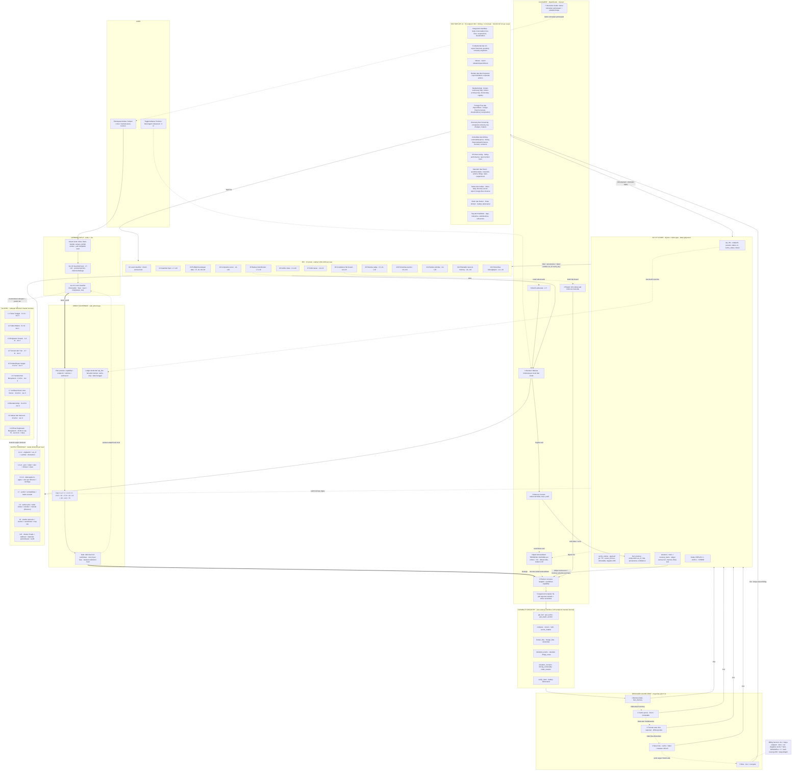

# ARSITEKTUR INVESTIGRAPH — satu gambar

**Cara membaca:**
- Garis tebal (`==>`) = alur utama yang mengikat biaya/persetujuan · garis putus-putus (`-.->`) = fallback/opsional/digest.
- Angka "kr" di level = estimasi dingin; cap keras ada di Credit Governor.
- Semua jalur ke LLM lewat Capability Registry; semua tembakan Sectors lewat Resolver (cache-first) dan tercatat di API Hit Store.

**Cakupan gambar:** 10/10 level · 13/13 domain (54 endpoint) · 13/13 posisi Jev · **7/7 peran LLM** (+ digest kode) · 5/5 tangga resolver · **5/5 tabel store** · 7/7 kontrak output.

**Detail output ke user:** lihat [`OUTPUT-LAYER.md`](./OUTPUT-LAYER.md) — kontrak `AnswerDoc` + Visual Registry + komposisi visual per level & per domain (dark-first, motion, drill-down cache-first, ekspor PNG).

**Riwayat & memory:** lihat [`SESSION-MEMORY.md`](./SESSION-MEMORY.md) — dalam sesi: semua turn wajib jadi konteks; sesi baru: hanya memory, tanpa transkrip lama.

**Bentuk produk: chatbot murni** — input teks → jawaban. Tidak ada watcher, scheduler, atau pesan otonom di luar sesi.

---

## Peta peran LLM vs 6 syarat Track 01 (final, dikunci 21 Sep)

### 6 syarat lomba → bukti di arsitektur

| Syarat Track 01 | Bukti di arsitektur | Digerakkan oleh |
|---|---|---|
| Multi-step reasoning flows | dekomposisi → capability → verifikasi Jev → sintesis (L6–L10); preflight & citation check | LLM Planner + Jev (choice) |
| Custom tool-use pipelines | Capability Registry (bukan endpoint mentah) + Argument Compiler + Resolver | LLM Planner + Compiler, kode resolver |
| Routing between data sources | pilih 13 domain/capability; 5 tangga sumber (memory/cache/turunan/near-miss/live) | LLM pilih capability; kode pilih sumber |
| Memory / state management | `fact_memory` + `cache_entries` + digest + state sesi (level, ledger, fase) | Memory Curator (LLM) + kode |
| Autonomous task execution | eksekusi multi-langkah otonom dalam satu turn: Planner menjalankan langkah, Repair otomatis saat Jev menolak, eskalasi level adaptif + fail-safe | Planner + Repair + Governor (kode) |
| Purpose-built interface | Next.js UI + Interactive Guide + toggle 3 bahasa + ledger/audit transparan | LLM Guide + Narrator |

### Peran LLM final: 7 peran

| # | Peran | Fungsi | Syarat | Level aktif | Penjaga |
|---|---|---|---|---|---|
| 1 | **Planner** | pecah pertanyaan → langkah + capability + kondisi berhenti | multi-step | L4–L10 | Jev preflight |
| 2 | **Narrator** | narasi Bahasa Indonesia per level; **3 varian sekaligus** (pemula/menengah/advanced), angka via placeholder diisi kode; sintesis dossier | interface | L2–L10 | Jev kritik narasi + verifier (per varian) |
| 3 | **Devil's advocate** | argumen lawan & pembalik tesis | multi-step | L7–L10 | Jev battery |
| 4 | **Repair** | tulis ulang saat kritik/compliance Jev menolak | multi-step | L4–L10 | Jev compliance (fail-closed) |
| 5 | **Argument Compiler** | NL → argumen capability terketik: tanggal ("2 minggu terakhir"), simbol, `where` terstruktur | tool-use | L3–L10 | validasi schema zod |
| 6 | **Memory Curator** | tulis fakta/tesis/profil ke `fact_memory` + recall lintas sesi | memory | L6–L10 | Jev #12 + provenance wajib |
| 7 | **Interactive Guide** | bantu user merumuskan pertanyaan, tempel rumor, jelaskan biaya level | interface | L1–L10 (pra-query) | aturan + template |

Catatan: **Digest ketersediaan bukan LLM call** — dihasilkan kode dari store (deterministik, 0 kr), lalu disuntik ke prompt. **Narrator menulis 3 varian per jawaban** (placeholder `{{fact:id}}` diisi kode per mode) → toggle bahasa di klien instan, tanpa API/LLM/Jev lagi; satu varian gagal Jev → hanya varian itu di-Repair.

### Sengaja BUKAN peran LLM

- Digest ketersediaan → kode (deterministik, 0 kr).
- Routing sumber/cache (memory→cache→turunan→live) → resolver kode.
- Aritmetika & tanggal → kode (anti-halusinasi).
- Skor & verdict → Jev choice.
- Verifikasi sitasi & compliance → Jev choice (fail-closed).

> Jadwal realistis: L1–L2 sering tanpa LLM (template + memory), L3–L5 Planner+Narrator+Compiler, L6–L10 hampir seluruh peran aktif.

---

## Kebijakan verifikasi berlapis — hal-hal penting adalah ranah Jev

Prinsip: **LLM tidak pernah menjadi hakim outputnya sendiri.** Tiga lapis, dari yang paling murah & deterministik:

| Lapis | Memverifikasi | Contoh | Biaya |
|---|---|---|---|
| 1 · Kode | yang mekanis & bisa dibuktikan | angka ada di payload cache (path + nilai), aritmetika dihitung ulang, tanggal wajar, schema zod, as_of/kesegaran, satuan | 0 |
| 2 · **Jev (choice)** | yang semantik | klaim didukung/tidak + kekuatannya, narasi vs data, severity pola pompom, compliance aman/tidak, prioritas, kelengkapan, asumsi, pairwise | ~$0,0001/call |
| 3 · Fail-closed | keraguan pada hal sensitif | Jev ambigu → blokir / rumuskan ulang / turunkan klaim · tidak pernah lolos diam-diam | 0 |

Aturan:

1. **Verifikasi angka = kode dulu.** Jev hanya untuk klaim fuzzy yang tak bisa dicek mekanis.
2. **Jev = hakim hal penting** (verdict klaim, compliance, severity) — bukan LLM. Alasan: pilihan terbatas jadi tak bisa mengarang; ~63× lebih murah; ~200× lebih cepat; dan bukti riset: citation check menangkap angka karangan, pairwise judge 10/10 tanpa position bias.
3. **Confidence Jev tidak dipercaya mentah** (riset: buruk terkalibrasi) → **probabilitas L7 dihitung kode** dari agregat bukti (skor tertimbang → peta band yang dikalibrasi lewat test suite); Jev hanya memilih kategori kualitatif.
4. **LLM hanya drafting + repair**; setiap output wajib lulus Jev #6 (sitasi), #7 (kritik narasi), #8 (compliance) sebelum keluar.
5. **Semua keputusan Jev dicatat** (choice + criteria + waktu) → bagian dari audit trail yang dilihat juri.
6. **Batasan Jev dijaga di hulu**: multi-intent dipecah kode dulu; state yang dikirim disaring (hasil filter, bukan payload mentah).
7. **Ketergantungan provider**: endpoint Jev alpha gagal → retry → fallback LLM ber-rubrik ketat (ditandai "degraded"); khusus compliance tetap fail-closed.