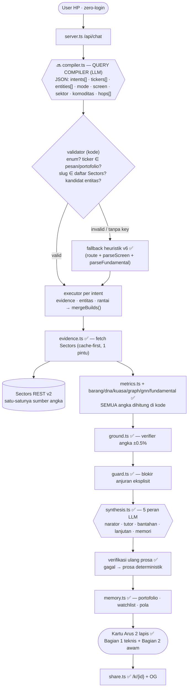
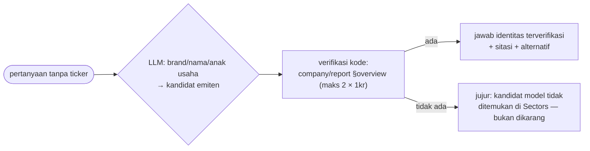
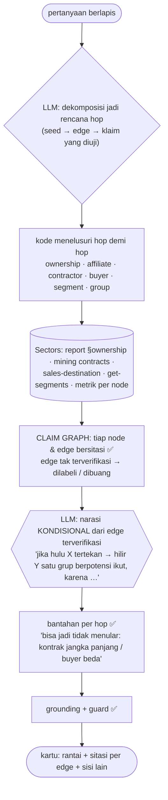
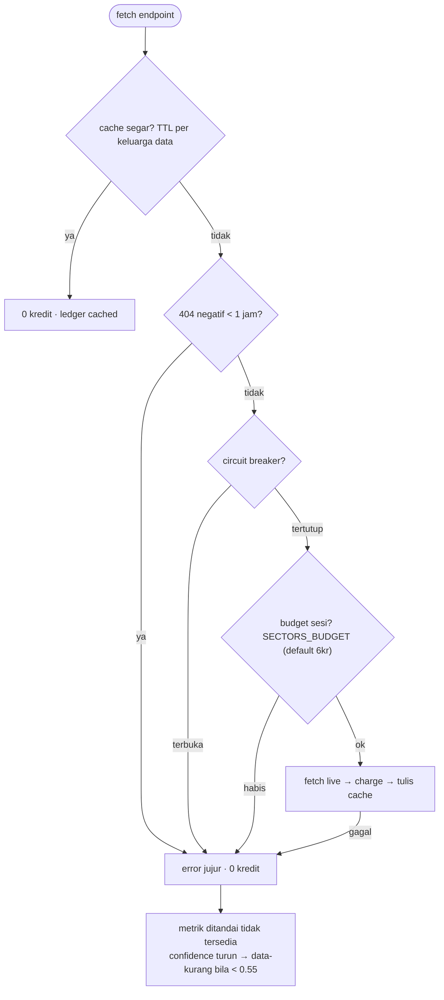

# Arsitektur ARUS v7 — LLM-first, deterministik di tempat yang seharusnya

> Menggantikan arsitektur v6. Pelajaran pemicunya: **parser keyword tidak akan pernah cukup untuk pertanyaan liar**
> ("saham Indomaret apa?", "hulu konglomerasi bermasalah, hilirnya gimana?"). Prinsip tunggal v7:
> **LLM untuk memahami bahasa; kode untuk hal yang obviously deterministic by nature.**
> Penanda: ✅ sudah ada di kode · 🔜 fase berikutnya (lihat `BUILD_PLAN.md`).

## 1. Pembagian tugas (aturan keras)

| Lapisan | Pemilik | Isi |
|---|---|---|
| Interpretasi bahasa | **LLM: query compiler** (1 call) | multi-intent, brand/nama → kandidat ticker, mode fundamental, kriteria screener, kata sektor, slug komoditas, rencana hop reasoning |
| Eksekusi & angka | **kode** | fetch Sectors, metrik (`metrics.ts` dkk), agregasi, YoY, porsi segmen |
| Verifikasi | **kode** | grounding angka ±0.5%, validasi enum/schema, validasi slug ke helper list, **verifikasi ticker ke Sectors** |
| Keselamatan | **kode** | guard nasihat, disclaimer, jalur "data tidak tersedia" |
| Ekonomi | **kode** | cache/TTL/404 negatif/breaker/ledger/budget (`credit.ts`) |
| Bahasa akhir | LLM + kode | narator & tutor divalidasi; gagal → versi deterministik |
| Jaring pengaman | **kode** | parser heuristik v6 hidup **hanya** bila LLM absen/invalid — bukan otak utama |

Aturan yang tidak boleh dilanggar siapa pun:
1. LLM tidak pernah memegang angka final, tidak menghitung, tidak mengarang ticker/slug.
2. Setiap output LLM (compiler maupun sintesis) **wajib lolos validasi** sebelum dieksekusi.
3. Setiap klaim kausal/relasi harus punya edge bersitasi; edge yang tidak ada di data = dilabeli "inferensi, tidak terverifikasi" atau dibuang.
4. Tanpa `OPENROUTER_API_KEY` → seluruh pipeline jalan deterministik; tanpa `SECTORS_API_KEY` → error jujur.

## 2. Alur satu pertanyaan



## 3. Query compiler 🔜 (jantung v7)

Satu panggilan LLM (`meta/muse-spark-1.2` + effort `xhigh`) dengan output JSON ketat:

```json
{
  "intents": ["rantai", "fundamental"],
  "tickers": ["ADRO"],
  "entities": [{"name": "Indomaret", "candidates": ["DNET", "AMRT"], "relation": "pemilik jaringan"}],
  "fundamental_mode": "kinerja",
  "screen": {"criteria": "murah", "metric": "pe_ttm", "sector_word": "bank"},
  "commodity": {"word": "CPO", "slug_candidates": ["crude-palm-oil"]},
  "hops": [
    {"from": "ADRO", "edge": "ownership", "to": "anggota grup"},
    {"from": "komoditas", "edge": "exposure", "to": "emiten"}
  ],
  "alasan": "maks 120 char"
}
```

**Validator kode (deterministik by nature):**
- `intents` ⊆ enum (termasuk `entitas` dan `rantai` baru) — maks 3.
- `tickers`: 4 huruf; lolos bila muncul di pesan/portofolio, **atau** diverifikasi `company/report §overview` (1kr, dikutip).
- `entities`: kandidat dari pengetahuan model → wajib verifikasi Sectors sebelum diklaim; maks 2 kandidat per pertanyaan.
- `screen.metric` ⊆ whitelist field screener; `sector_word` diresolusi ke slug via `subsectors/industries` (kata tak dikenal → filter tidak dipasang, bukan menebak).
- `commodity.slug_candidates` diverifikasi ke `mining/commodities` (P1) — **bukan** tabel hardcode.
- `hops`: hanya edge yang dikenal (ownership · affiliate · contractor · buyer · segment · group).
- Tanpa key / JSON invalid / semua keluar enum → fallback heuristik v6 (0 kredit).

**Multi-intent:** LLM adalah sumber utama (1–3 intent, urut prioritas). Bila hasil LLM valid, heuristik **tidak menempelkan** intent tambahan (bug v6: "siapa direksi ASII?" kena bocoran `kuasa`). Penggabungan hasil tetap deterministik di `mergeBuilds()`: bukti & sitasi digabung, verdict sinyal terkuat, Bagian 2 di-dedupe per istilah.

## 4. Entity resolver 🔜 — "saham Indomaret apa?"



Aturan lama "ticker harus muncul di pesan" **diperluas**: ticker boleh berasal dari pengetahuan model asalkan terverifikasi Sectors. Arah sebaliknya juga jalan lewat data yang sudah ada: ticker → `§ownership` (induk/afiliasi) untuk "ini anak usaha siapa?".

## 5. Graph reasoning 🔜 — pertanyaan brutal berlapis

Contoh kelas soal: *"Kalau harga coal jatuh, siapa di grup ADRO yang paling kena — hulu bermasalah, hilirnya gimana?"*



Batas yang disengaja: kedalaman hop dibatasi budget (default 1–2 hop/edge per sesi, cache-first); kausalitas **selalu kondisional**, tidak pernah vonis; relasi grup dari `graph.ts` (union-find) + `KNOWN_GROUP_BY_SYMBOL` dilabeli "kemungkinan relasi" seperti autopsi.

## 6. Yang deterministik by nature (tetap kode, selamanya)

| Area | Modul | Alasan |
|---|---|---|
| Aritmetika & agregasi | `metrics.ts`, `fundamental.ts`, `barang.ts`, `graph.ts`, `gnn.ts` | matematika harus reproducible |
| Validasi schema & enum | (baru di compiler validator) + `screener.ts`, `slugs.ts` | keamanan eksekusi |
| Grounding & guard | `ground.ts`, `guard.ts` | kebenaran & kepatuhan |
| Ekonomi kredit | `credit.ts`, `sectors.ts` | uang & determinisme cache |
| Format & tampilan | `fundamental.ts` formatter, `awam.ts`, `server.ts` | output stabil, offline-testable |
| Fixture | `seed.ts` | eval offline 0 kredit |
| Merge multi-intent | `mergeBuilds()` | urutan & dedupe pasti |

## 7. Kredit & kejujuran data



Tim punya 1.000 kredit; budget 6kr/sesi adalah **default hemat**, bukan plafon platform — dinaikkan sadar via `SECTORS_BUDGET` untuk demo/verifikasi. Biaya mengikuti docs: report 1kr/section, quarterly 1kr/kuartal, screener 1kr (NL 3kr), helper 1kr, segmen 1kr.

## 8. Modul

| Modul | Peran | Status |
|---|---|---|
| `lib/planner.ts` | compiler LLM-first + validasi + fallback heuristik | 🔜 refactor (v6: dua router) |
| `lib/compiler.ts` · `entity.ts` · `chain.ts` | compiler schema/validator · resolver brand→ticker · mesin hop reasoning | 🔜 baru |
| `lib/router.ts` | fallback keyword (route) — jaring pengaman, bukan otak | ✅ |
| `lib/resolve.ts` + `symbols.ts` | ekstraksi ticker universal, stopword, portofolio, kode broker | ✅ |
| `lib/evidence.ts` + `seed.ts` | 20 endpoint Sectors; fixture hanya saat SEED=1 | ✅ |
| `lib/sectors.ts` + `credit.ts` | cache, TTL, 404 negatif, breaker, budget env, ledger | ✅ |
| `lib/metrics.ts` | FOMO, Kohort Flow, likuiditas, dividen, return, drawdown | ✅ |
| `lib/screener.ts` | kriteria screener + resolusi kata sektor ke slug helper | ✅ |
| `lib/fundamental.ts` | mode fundamental (valuasi/kinerja/tahunan/segmen/prospek/manajemen/peer/profil) + formatter | ✅ |
| `lib/barang.ts` · `dna.ts` · `kuasa.ts` · `graph.ts` · `gnn.ts` | derived asset: divergence, DNA broker, cluster, GrupGraph, anomali | ✅ |
| `lib/ground.ts` · `guard.ts` | verifier grounding & blokir nasihat (dieksekusi) | ✅ |
| `lib/synthesis.ts` | 5 peran LLM + ringkas memori; tanpa key → deterministik | ✅ |
| `lib/awam.ts` | Bagian 2 kartu: istilah → arti → analogi → kondisi + intisari | ✅ |
| `lib/memory.ts` | portofolio, watchlist, keputusan, pola chase | ✅ |
| `mcp/server.ts` | 8 tools, parameter dihormati, kill test Sectors | ✅ |
| `server.ts` | chat + kartu 2 lapis + share `/k/{id}` + OG | ✅ |