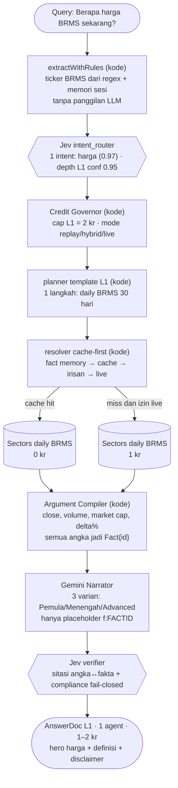
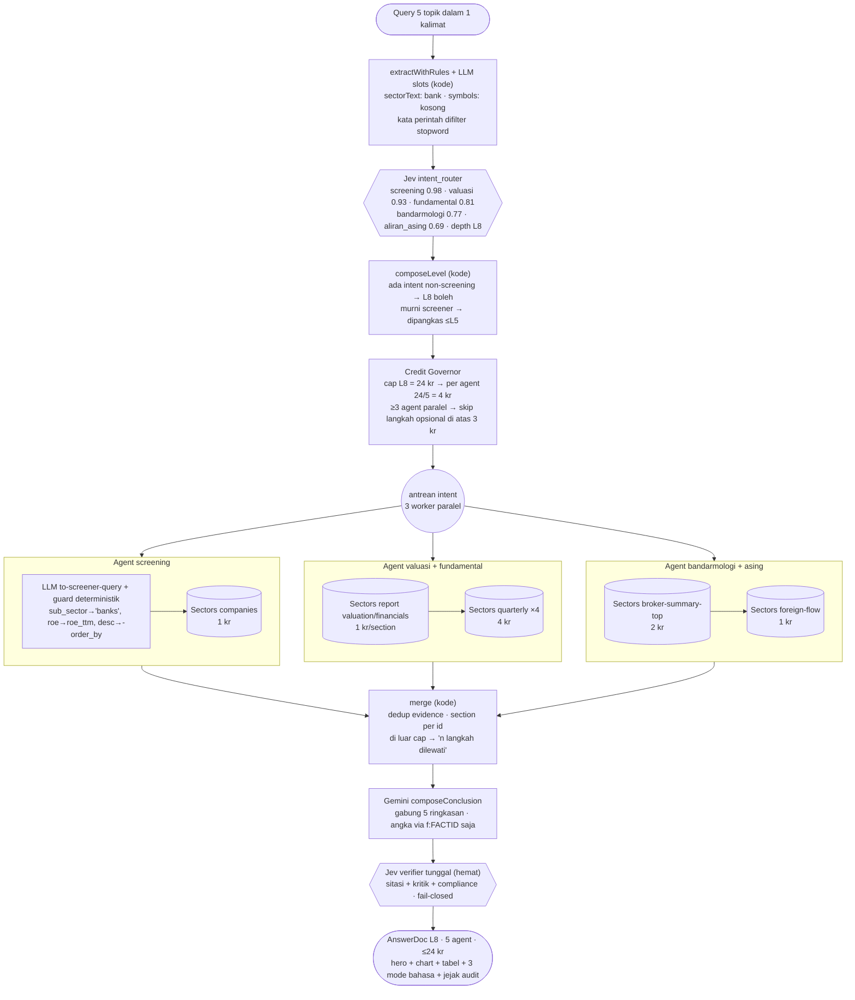

# INVESTIGRAPH — Sectors Hackathon 2026 · Track 01 (AI Agents & Assistants)

> **Pernyataan masalah (satu kalimat):** Investor ritel Indonesia punya data pasar yang mahal dan rumit, tapi tidak punya penerjemahnya — INVESTIGRAPH mengubah satu pertanyaan bahasa Indonesia menjadi dokumen riset tersitasi penuh, dalam 3 level kedalaman, dengan biaya kredit yang dikendalikan otomatis.

Asisten riset saham IDX berbasis data: **angka 100% dari Sectors REST API, semua perhitungan & keputusan alur di kode milik kami, LLM hanya menulis bahasa**. Setiap jawaban membawa jejak audit: endpoint mana, kapan, berapa kredit, fakta mana mendukung kalimat mana.

Doktrin produk: **Masteri Konstan, Cakupan Variabel** — 10 level analisis (L1–L10); biaya kredit mengikuti kesulitan pertanyaan, bukan panjang chat.

> Bukan rekomendasi jual/beli dan tanpa eksekusi order (lihat §Kepatuhan). Semua angka bersitasi; keputusan tetap tanggung jawab pengguna.

## Bukti kelayakan Track 01 — logika agen adalah produknya

Track mensyaratkan *custom-built agent logic*, bukan "klien siap pakai + prompt". Komponen di bawah tidak ada di klien mana pun dan hidup di repositori ini:

| Kriteria "What qualifies" | Implementasi konkret |
|---|---|
| **Multi-step reasoning flows** | Pipeline 9 tahap deterministik: guardrail → intent classifier → planner → Credit Governor → resolver cache-first → Argument Compiler → Narrator → verifier → AnswerDoc (`src/lib/agent/pipeline.ts`) |
| **Custom tool-use pipelines** | Registry **48 endpoint** Sectors (IDX + Mining) dengan ekstraktor fakta per-endpoint, normalisasi argumen, repair klausa `where`, dan aturan billing own-case (`src/lib/sectors/registry.ts`) |
| **Routing antara sumber data** | 17 intent recipe × 13 domain × 10 level; classifier hybrid aturan+LLM; resolver memilih memory → cache → irisan window → derivasi lintas-cache → live, per mode `replay/hybrid/live` |
| **Memory / state management** | Fact memory lintas-turn (fakta tak kedaluwarsa dipakai ulang 0 kr), session memory untuk follow-up ("kalau yang kemarin?"), digest jawaban, ledger kredit per panggilan |
| **Autonomous task execution** | Planner menyusun langkah sendiri dari pertanyaan (fan-out multi-intent, fase 1/2/3 dengan opsi lewat saat cap kredit habis); LLM screener-to-query dengan guard deterministik di depan & repair di belakang |
| **Purpose-built interface** | Kontrak `AnswerDoc` (zod) + Visual Registry (Recharts/SVG/tabel) + 3 varian narasi (Pemula/Menengah/Advanced) yang berganti **instan, 0 kr, 0 panggilan LLM** — narasi disimpan bertiga sekaligus |

**Ujian "prompt dicabut":** hapus semua prompt, pipeline tetap berjalan penuh (level template + intent recipe + compiler deterministik); yang hilang hanya variasi bahasa. Doktrin intinya: **LLM tidak pernah menulis digit** — narasi memakai placeholder `{{f:FACTID|format}}` yang diisi kode dari fakta terverifikasi.

## Arsitektur satu pertanyaan

```
user → guardrail (Jev) → klasifikasi level & intent (aturan + Jev conf 0.89)
     → planner: 17 intent recipe / template level×domain / LLM screener-query
        + guard deterministik: taksonomi slug IDX, field _ttm/_mrq, bracket tahun
     → Credit Governor (cap per level + budget harian)
     → resolver cache-first: fact memory → cache → irisan window → derivasi → live
        (billing rules real API: 2xx tagih, 404=1kr, 400/401/429 gratis)
     → Argument Compiler: fakta + metrik turunan dihitung kode (net flow, delta, rasio)
     → Narrator LLM: 3 varian bahasa, hanya placeholder
     → verifier Jev: sitasi angka↔fakta, kritik narasi, compliance fail-closed
     → AnswerDoc → render (kartu, chart, tabel, jejak audit)
```

- **Jev (typesafe/jev-1.13 via OpenRouter)** dipakai untuk keputusan atomik, bukan chat: guardrail input, klasifikasi kedalaman, verifikasi sitasi, kritik narasi, kepatuhan — semua tercatat di `data/jev-log.jsonl`.
- **Anti-halusinasi berlapis:** verifier menolak klaim tanpa fakta pendukung (gagal-tertutup); jawaban degradasi eksplisit menyebut status data, bukan mengarang.
- **Terbukti di lapangan:** bug nyata API (parameter `desc` ditolak, field `roe` butuh kurung tahun, taksonomi `perkebunan` = slug `agricultural-products`) dipetakan ke repair deterministik + test regresi — bukan diasumsikan dari dokumentasi.

### Dua ujung spektrum — intent tunggal vs multi-intent maksimal

Legenda bentuk: kotak = code milik tim · `{{hexagon}}` = keputusan Jev · silinder = data Sectors · stadium = user/output.

**1. Intent paling sederhana** — `Berapa harga BRMS sekarang?` (1 intent, L1, ≤2 kr):



**2. Multi-intent maksimal** — `Carikan saham bank murah, bandingkan valuasi & fundamentalnya, siapa yang akumulasi, asing masuk atau keluar?` (5 intent paralel, L8, cap dibagi per agen):




## Kesiapan demo & penilaian (aturan §6 & §9)

- **MVP end-to-end berfungsi**: chat → dokumen riset bersitasi; mode `replay` menjawab alur penuh **0 kr** dari cache riset — demo stabil tanpa bergantung kredit/sisa kuota.
- **Skor kualitas terukur**: `pnpm mastery` menjalankan **39 kasus** (13 domain × 3 tingkat) melalui pipeline penuh; `pnpm test` 29 unit test; typecheck + lint bersih.
- **Repo publik tanpa secret**: kunci via `.env` (lihat `.env.example`), tidak ada kredensial ter-commit.
- Sectors bukan hiasan: hilangkan Sectors, produk kehilangan seluruh fungsinya (satu-satunya sumber angka).

## Menjalankan

```bash
pnpm install
cp .env.example .env        # isi SECTORS_API_KEY + OPENROUTER_API_KEY
pnpm seed                   # muat cache riset (opsional; mengunci demo di mode replay, 0 kr)
pnpm dev                    # http://localhost:3000
```

Build produksi: `pnpm build && pnpm start`.

## Skrip

| Skrip | Fungsi | Biaya |
|---|---|---|
| `pnpm seed` | impor cache respons riset ke store (mode replay) | 0 kr |
| `pnpm smoke` | cek resolver + 1 panggilan Jev; `--live` ≤5 kr; `--chat` satu turn penuh | 0–5 kr |
| `pnpm sweep --dry-run` | daftar seluruh endpoint + estimasi biaya | 0 kr |
| `pnpm sweep --live --budget=61` | uji seluruh endpoint terdaftar | ±61 kr |
| `pnpm mastery` | 39 kasus mastery melalui pipeline penuh | 0 kr (replay/near-miss) |
| `pnpm typecheck` / `pnpm lint` / `pnpm test` | kualitas kode | 0 kr |

## Struktur berkas

```
src/lib/config.ts              env, cap kredit per level (L1–10), 13 domain, budget harian
src/lib/db/                    SQLite: api_hits (ledger), cache_entries (blob gzip content-addressed),
                               fact_memory, sessions/turns/memory_items
src/lib/sectors/registry.ts    48 endpoint Sectors + ekstraktor fakta + normalisasi/repair argumen
src/lib/sectors/client.ts      resolver cache-first: memory→cache→irisan→derivasi→live + aturan billing
src/lib/llm/openrouter.ts      klien LLM (JSON mode, effort, retry)
src/lib/llm/jev.ts             klien keputusan Jev + logging audit
src/lib/agent/                 guardrail · slots · classifier · digest · planner · governor ·
                               intents(17) · tools · compiler · narrator · verify · pipeline
src/lib/output/answerdoc.ts    kontrak AnswerDoc (zod) — termasuk spec visual & placeholder fakta
src/components/                shell chat + Visual Registry (Recharts/SVG/tabel) + render placeholder
scripts/                       seed · smoke · sweep · mastery
riset/                         dokumentasi verifikasi live API (coverage, pain points, pola Jev)
```

## Kontrol biaya (kredit Sectors)

- HTTP 2xx = biaya penuh (report 1 kr/section, quarterly 1 kr/kuartal, most-traded 2 kr, screener 1/3 kr).
- **404 tetap 1 kr**; 400/401/403/429/5xx gratis; 200 kosong tetap ditagih — semua dipatuhi governor.
- Credit Governor membatasi per level: L1–2 = 2 kr, L3–4 = 8, L5–6 = 16, L7–8 = 24, L9 = 40, L10 = 70, plus budget harian (`SECTORS_DAILY_BUDGET`, default 60 kr).
- Setiap panggilan/miss/hit tercatat di `api_hits`; jawaban menampilkan total kr + sumber per fakta. Cache-hit = 0 kr, dan hampir semua biaya adalah *satu-satunya* biaya: hasil tetap gratis saat ditanya ulang.

## Kepatuhan & batasan yang dinyatakan jujur

- **Tanpa eksekusi order** — tidak ada integrasi broker, tidak ada jalur order apa pun di kode; **tanpa nasihat keuangan** — compliance check fail-closed + disclaimer di setiap jawaban.
- Cakupan pasar: **IDX + ekstensi mining**; SGX/KLSE di luar (dipotong sadar, dinyatakan eksplisit).
- Batas API dihormati: `daily`/`index-daily`/`idx-total` ≤90 hari, `broker-summary`/`broker-activity` ≤14 hari, harga komoditas ≤3 tahun.
- Data yang tidak ada tetap dijawab "tidak ada" (contoh terverifikasi live: CPO tidak tersedia di database harga Sectors).

## Lisensi & kredit data

Data: [Sectors Financial API](https://docs.sectors.app). Keputusan atomik: model `typesafe/jev-1.13` via OpenRouter.
