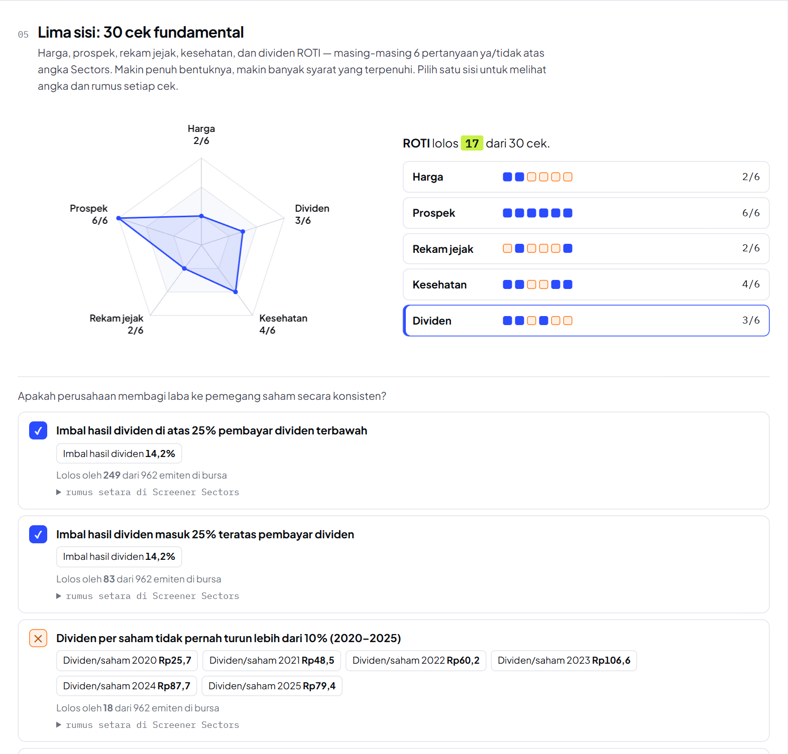
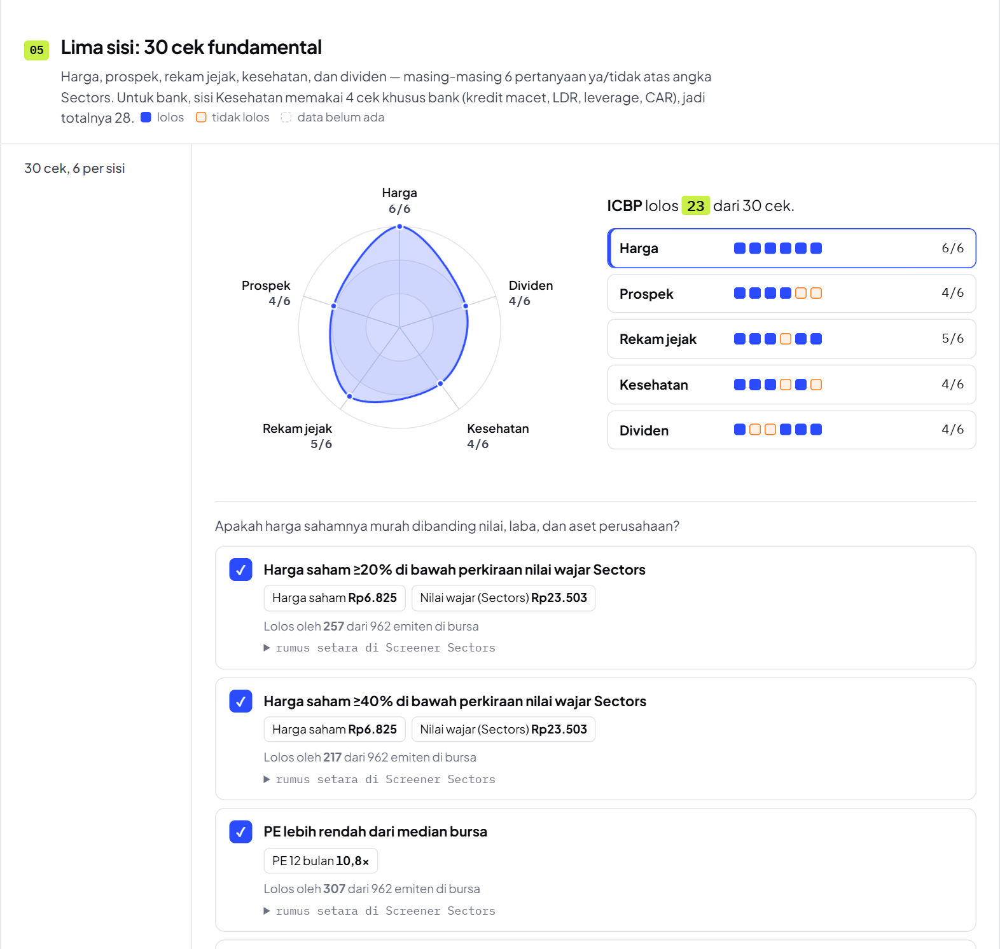
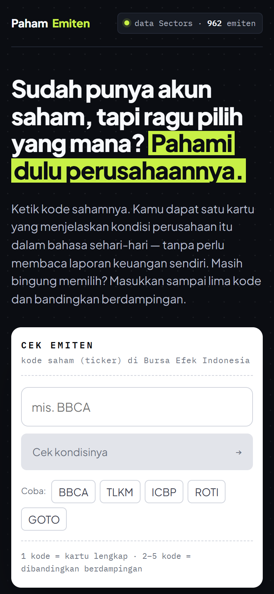
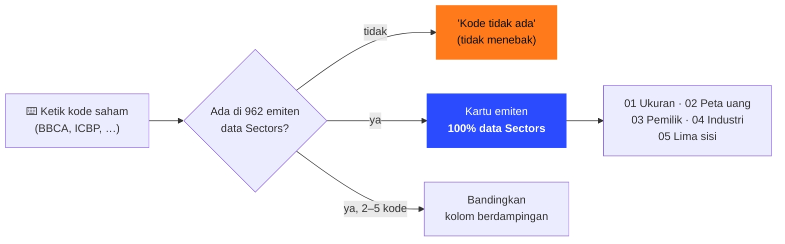
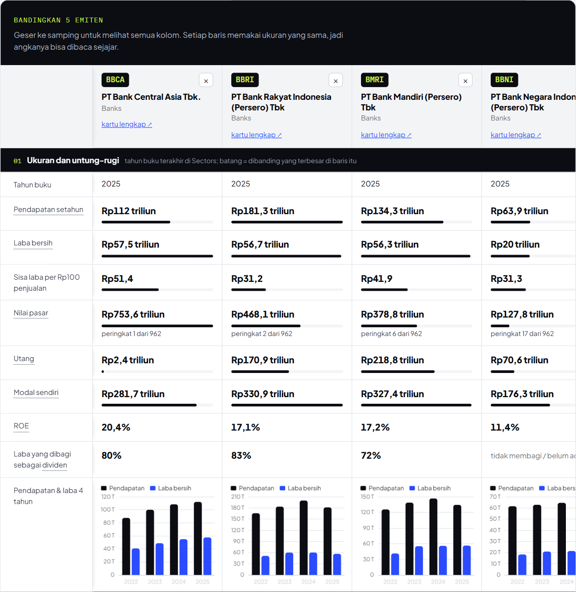

<div align="center">

# Paham Emiten

**Sudah punya akun saham, tapi ragu pilih yang mana? Pahami dulu perusahaannya.**

Ketik kode sahamnya. Kamu dapat satu kartu yang menjelaskan kondisi perusahaan di Bursa Efek Indonesia<br>
dalam bahasa sehari-hari: seberapa besar, untung atau rugi, siapa pemiliknya, dan hasil 30 cek fundamental.


[](https://github.com/chukbert/sectors-hackathon-2026/actions/workflows/ci.yml)

### 🌐 Coba langsung: **[sectors.muflichlabs.online](https://sectors.muflichlabs.online)** — tanpa daftar, tanpa install


</div>

---

## Untuk juri: 60 detik

- **Untuk siapa.** Pemegang akun sekuritas yang pasif: orang yang sudah tahu investasi itu penting dan sudah membuka akun, tapi akunnya diam. Yang menahan mereka bukan niat, melainkan dua pertanyaan: *"perusahaan ini bagus atau tidak?"* dan *"kondisinya sekarang bagaimana?"*. Jawabannya tersebar di laporan keuangan berbahasa akuntansi dan aplikasi yang dibuat untuk trader.
- **Yang kami bangun.** Satu kotak kode saham (ticker) → **kartu emiten** yang 100% dibangun dari data Sectors, dalam bahasa Indonesia sederhana: ukuran dan untung-rugi (*"dari setiap Rp100 pendapatan, sisa laba Rp X"*), peta uang dari segmen pendapatan, rantai pemilik sampai grup konglomerasi, perbandingan dengan pesaing, dan **lima sisi**: 30 cek fundamental ya/tidak (harga, prospek, rekam jejak, kesehatan, dividen) ala model terbuka Simply Wall St. Masih ragu di antara beberapa emiten? Masukkan **2–5 kode** dan semuanya tampil sebagai kolom berdampingan, baris demi baris.
- **Menjawab "bagus atau tidak" tanpa memberi saran beli/jual.** Kartu tidak memberi skor bintang. Kartu menulis *"ROTI lolos 17 dari 30 cek"*, lalu setiap cek menunjukkan angkanya, artinya, dan *"lolos oleh N dari 962 emiten"*, sehingga pengguna belajar cara menilai, bukan sekadar menerima vonis.
- **Sectors adalah inti.** Jalankan dengan `STRUK_SECTORS_OFF=1` dan semua endpoint menolak: *tidak ada angka tanpa Sectors* (diuji otomatis). Setiap angka di layar bisa dibuka asal-usulnya: endpoint, field, query, waktu ambil.
- **Pemakaian Sectors yang tidak biasa.** Seluruh bursa (962 emiten × 77 field) diambil hanya dengan **25 panggilan Screener**, memanfaatkan `include_query_values`. Total 258 kredit untuk seluruh proyek (termasuk peta uang untuk semua 219 emiten yang punya data segmen); **0 kredit per pengguna**.
- **Lima sisi, 0 kredit tambahan.** Setiap cek adalah sebuah ekspresi `where` Sectors yang ditampilkan ke pengguna. Pembandingnya (median bursa, median industri, persentil dividen) dihitung dari matriks yang sama. Bank otomatis memakai 4 cek kesehatan khusus bank. Penyimpangan dari model asli ditulis terbuka di layar.
- **Tanpa AI generatif sama sekali.** Tidak ada LLM, tidak ada API key selain Sectors (dan itu pun tidak dibutuhkan saat runtime). Semua kalimat di kartu adalah templat tetap yang diisi angka Sectors, dan semua penjelasan istilah kami tulis sendiri. Jadi tidak ada satu kata pun yang bisa dikarang mesin, dan kartu terbuka dalam waktu kurang dari satu detik.
- **Bisa diverifikasi.** Demo live di atas · `docker compose up --build` · 95 tes + CI · semua respons Sectors mentah ada di `fixtures/snapshot/`.

---

## Input → Output

### Ketik `ROTI` → apakah perusahaannya bagus?



Kode **ROTI** dicek ke data Sectors, lalu kartu PT Nippon Indosari Corpindo Tbk (pembuat Sari Roti) langsung terbuka.

Sisi **Dividen** memperlihatkan jebakan yang sering membuat pemula salah langkah. Imbal hasil dividen ROTI 14,2%, masuk 25% teratas bursa, jadi kelihatan menggiurkan. Tetapi dua cek di bawahnya tidak lolos: dividen yang dibagi **259% dari laba** (lebih besar dari labanya sendiri), dan dividen terakhir tidak tertutup oleh perkiraan laba 2026. Di blok 01, kartu yang sama menulis bahwa dari setiap Rp100 pendapatan ROTI, hanya sekitar **Rp6,9** yang jadi laba bersih. Pengguna melihat sendiri *kenapa* angka yang menarik belum tentu sehat, tanpa kami menyuruh beli atau jual.

Coba langsung: [ROTI](https://sectors.muflichlabs.online/?emiten=ROTI) · [ICBP](https://sectors.muflichlabs.online/?emiten=ICBP) · [BBCA, dinilai sebagai bank](https://sectors.muflichlabs.online/?emiten=BBCA) · [GOTO](https://sectors.muflichlabs.online/?emiten=GOTO)

<sub>Screenshot asli: Chrome headless membuka kartu ROTI dan memilih sisi Dividen, tanpa disunting.</sub>

---

## Isi kartu emiten

Setiap kartu dibangun 100% dari data Sectors. Contoh di bawah: **ICBP** (Indomie).

<table>
<tr>
<td width="50%"><b>01 · Seberapa besar?</b><br><sub>"Dari setiap Rp100 pendapatan…", peringkat dari 962 emiten, tren 4 tahun</sub><br></td>
<td width="50%"><b>02 · Peta uang</b><br><sub>Segmen pendapatan → biaya → laba (Sankey dari endpoint segments)</sub><br></td>
</tr>
<tr>
<td><b>03 · Siapa pemiliknya?</b><br><sub>Porsi publik + rantai pengendali: ICBP ← INDF ← First Pacific → Grup Salim</sub><br></td>
<td><b>05 · Lima sisi</b><br><sub>30 cek fundamental ya/tidak — "lolos oleh 257 dari 962 emiten"</sub><br></td>
</tr>
</table>

<details>
<summary><b>📱 Tampilan ponsel</b></summary>
<br>
<p align="center">
&nbsp;&nbsp;
</p>
</details>

---

## 1. Masalahnya

Kami menulis untuk satu orang: **pemegang akun sekuritas yang pasif**. Ia sudah melek bahwa investasi itu penting, sudah membuka akun (sering karena promo atau ajakan teman), mungkin pernah membeli satu-dua saham yang ramai dibicarakan, lalu berhenti. Ia tidak butuh diyakinkan untuk berinvestasi. Ia butuh jawaban untuk dua hal:

1. **Bagaimana menentukan perusahaan ini bagus atau tidak?** Istilah seperti PER, ROE, DER, dan *payout ratio* muncul di mana-mana tanpa penjelasan kapan angka itu baik.
2. **Bagaimana kondisi emiten ini sekarang, dalam bahasa Indonesia sederhana?** Laporan keuangan ditulis untuk akuntan, dan aplikasi sekuritas dibuat untuk orang yang sudah paham pasar.

**Paham Emiten** menjawab keduanya dalam satu kartu:

- **Kondisi** ditulis sebagai kalimat, bukan tabel rasio: *"dari setiap Rp100 pendapatan, yang tersisa jadi laba bersih sekitar Rp6,9"*, *"ICBP dikendalikan INDF, yang dikendalikan First Pacific, bagian dari Grup Salim"*. Setiap istilah teknis bergaris titik dan bisa diketuk untuk penjelasannya.
- **Bagus atau tidak** dipecah menjadi 30 pertanyaan ya/tidak yang bisa diperiksa satu per satu, masing-masing dengan angkanya, pembandingnya, dan berapa emiten lain yang lolos. Pengguna belajar cara berpikirnya, bukan sekadar menerima skor.
- **Input cukup kode saham.** Pengguna kami sudah melek investasi dan sudah melihat ticker di aplikasi sekuritasnya, jadi kami tidak menebak dari nama merek. Saat mengetik, muncul saran kode beserta nama perusahaannya (`BB` → BBCA, BBNI, BBRI, …) supaya tidak salah emiten. Kepala kartu tetap menampilkan merek yang dikenal (ICBP → Indomie, Chitato, …) dari katalog kurasi 86 emiten, agar bisnisnya langsung tertangkap.

**Insight turunan, bukan data mentah** (track Market Intelligence): 30 cek fundamental lima sisi dengan pembanding median bursa dan industri, peringkat dari 962 emiten, rasio "per Rp100 pendapatan", perbandingan se-industri, dan rantai pengendali yang ditelusuri dari data pemegang saham.

## 2. Cara kerjanya


```mermaid
flowchart LR
    A["⌨️ Ketik kode saham<br>(BBCA, ICBP, …)"] --> D{"Ada di 962 emiten<br>data Sectors?"}
    D -- tidak --> E["'Kode tidak ada'<br>(tidak menebak)"]
    D -- ya --> F["Kartu emiten<br><b>100% data Sectors</b>"]
    F --> G["01 Ukuran · 02 Peta uang<br>03 Pemilik · 04 Industri<br>05 Lima sisi"]
    D -- "ya, 2–5 kode" --> H["Bandingkan<br>kolom berdampingan"]
    style F fill:#2b4bff,color:#fff,stroke:#2b4bff
    style E fill:#ff7a1a,color:#0b0d12,stroke:#ff7a1a
```

| Bagian kartu | Isi | Sumber Sectors |
|---|---|---|
| 01 Seberapa besar | Pendapatan, laba, nilai pasar + peringkat dari 962 emiten, utang vs modal, dividen, tren 4 tahun, **"dari setiap Rp100 pendapatan, sisa laba Rp X"** | Screener `include_query_values` (matriks seluruh bursa) |
| 02 Peta uang | Diagram Sankey: segmen pendapatan → biaya → laba (rugi ditandai tangerine) | `/v2/company/get-segments/{symbol}/` |
| 03 Siapa pemiliknya | Pemegang saham, porsi publik, rantai pengendali (ICBP ← 80,5% INDF ← 50,1% First Pacific → Grup Salim) | `major_shareholders`, `affiliates` dari Screener |
| 04 Posisi di industrinya | Nilai pasar dibanding 5 emiten terbesar se-industri + tabel angka pembanding; satu ketukan menjajarkannya | Matriks Screener |
| 05 Lima sisi | Radar 5 sisi × 6 cek ya/tidak, angka setiap cek, rumus `where` setara, dan "lolos oleh N dari 962 emiten" | Matriks Screener tahap 2 (valuasi, forecast, riwayat 2020–2025, kesehatan, bank) |

Kode yang tepat langsung membuka kartunya; awalan kode (`BB`) menampilkan saran kode beserta nama perusahaan. Nama merek atau nama perusahaan bukan input, jadi aplikasi tidak pernah menebak emiten. Setiap kartu punya tautan sendiri (`/?emiten=ROTI`) untuk dibagikan.

### Bandingkan 2–5 emiten berdampingan

Pengguna kami jarang ragu soal satu emiten saja; biasanya mereka bingung memilih di antara beberapa. Ketik kode kedua sampai kelima di bilah atas (atau tekan **Bandingkan dengan teman sejenis** di kartu, atau kode pembanding di bagian 04), dan setiap emiten jadi satu kolom. **Satu emiten dan lima emiten memakai tampilan yang sama**: kepala gelap yang sama, bagian 01–05 yang sama, label baris yang sama. Kartu satu emiten hanyalah perbandingan satu kolom yang lebar, dengan isi tambahan (Sankey, semua pemegang, tabel pembanding, rincian 30 cek). Jadi berpindah dari satu ke banyak emiten tidak mengubah cara membaca. Setiap baris memakai ukuran yang sama: batang relatif terhadap yang terbesar di baris itu, tren 4 tahun, porsi segmen pendapatan, pemilik, posisi di industri, dan 30 cek lima sisi. Label baris menempel di kiri saat kolom digeser, dan nama kolom menempel di atas saat halaman digulir, juga di ponsel. Tautannya bisa dibagikan: `/?emiten=BBCA,BBRI,BMRI,BBNI,BNLI`.



Perbandingan memakai kartu yang sama dengan tampilan satu emiten, jadi **0 kredit tambahan** dan tidak ada angka baru yang perlu dipercaya.

### Lima sisi = 30 cek fundamental, 0 kredit tambahan

Kerangkanya diadaptasi dari [model analisis terbuka Simply Wall St](https://github.com/SimplyWallSt/Company-Analysis-Model): 5 sisi × 6 pertanyaan ya/tidak. Semua angka dari Sectors; setiap cek punya ekspresi `where` setara yang ditampilkan di layar dan bisa dijalankan ulang di Screener (`apps/core/app/struk/snowflake.py`).

| Sisi | Contoh cek | `where` (ICBP) |
|---|---|---|
| Harga | Harga ≥20% di bawah nilai wajar Sectors | `intrinsic_value > 0 and last_close_price < intrinsic_value * 0.8` |
| Prospek | Perkiraan pertumbuhan laba di atas median bursa | `forecast_eps_growth[2026] > 0.1974` |
| Rekam jejak | ROA di atas median kelompoknya | `roa[2025] > 0.049` (median industri Processed Foods) |
| Kesehatan | Laba operasi > 5× beban bunga | `interest_coverage_ratio[2025] > 5` |
| Dividen | Dividen ≤ 90% laba | `payout_ratio > 0 and payout_ratio <= 0.9` |

- **Hasil, bukan nilai.** Kartu menulis *"ICBP lolos 23 dari 30 cek"* dan setiap cek menyebut berapa emiten lain yang juga lolos. Kami tidak memberi skor bintang atau saran beli/jual.
- **Data kosong ≠ gagal.** Cek tanpa data Sectors ditandai "tidak bisa dinilai" (–), tidak dihitung tidak lolos. Prospek hanya tersedia untuk ±10% emiten yang diliput analis.
- **Bank dinilai sebagai bank.** Utang bank sebagian besar adalah simpanan nasabah, jadi 6 cek kesehatan diganti 4 cek bank: NPL < 2%, LDR < 110%, aset < 20× modal, CAR > 8%.
- **Penyimpangan dari model asli, ditulis di layar:** data Sectors mulai ±2020, jadi cek "10 tahun" menjadi 5 tahun. Sectors tidak menyediakan suku bunga bebas risiko, jadi cek pertama Prospek memakai syarat alternatif model asli (diperkirakan untung). Perkiraan ROE dan dividen 3 tahun didekati dengan perkiraan laba 2026. PEG memakai pertumbuhan historis Sectors, dan perusahaan rugi tidak bisa lolos PEG.

## 3. Kenapa Sectors adalah inti, bukan hiasan

**Uji copot:** jalankan Core dengan `STRUK_SECTORS_OFF=1` — semua endpoint, termasuk pencarian, menolak dengan
`"Tanpa data Sectors, aplikasi ini tidak bisa menampilkan apa pun — kami tidak mengarang angka."`
Tidak ada sumber angka cadangan.
 Ini diuji otomatis (`test_sectors_off_kills_the_app`).

**Tanpa LLM.** Versi awal memakai LLM untuk membaca struk, lalu untuk menerjemahkan label segmen peta uang. Keduanya sudah dibuang. Sekarang semua teks di kartu adalah templat tetap atau data asli Sectors. Nama segmen di peta uang tampil apa adanya dari laporan (bahasa Inggris), dan halaman mengatakannya. Kartu dibangun murni dari data dan aturan yang bisa dibaca di kode (`apps/core/app/struk/`). Kode IDXMACA lama di repo memang memuat integrasi LLM opsional (OpenRouter), tetapi tidak dipanggil oleh satu pun endpoint `/v1/struk/*` dan tidak terjangkau di demo publik.

## 4. Pemakaian Sectors API yang hemat (dan tidak biasa)

Seluruh bursa (962 emiten × 77 field) diambil hanya dengan **25 panggilan Screener**, memanfaatkan fakta bahwa
`include_query_values=true` mengembalikan *setiap* field yang disebut di `where` — termasuk cabang `OR` dan field per-tahun:

```
where = symbol like '%' or revenue[2022] > -1e18 or revenue[2023] > -1e18 or … or affiliates in ['Salim'] or …
limit = 200, order_by = symbol, include_query_values = true      → 5 halaman × 5 grup field = 25 kredit
```

Hasil lima sisi dikunci tes terhadap angka asli di snapshot (`apps/core/tests/test_snowflake.py`): misalnya ICBP lolos cek nilai wajar dan PEG, BBCA dinilai dengan cek kesehatan bank, dan perusahaan rugi tidak bisa lolos PEG.

### Anggaran kredit (saldo awal tim 490)

| Tahap | Panggilan | Kredit |
|---|---|---|
| Validasi asumsi (`tools/validate_api.py`): aritmatika `where`, field list, suffix `.JK`, daftar segmen | 4 | 4 |
| Harvest matriks seluruh bursa | 10 | 10 |
| Harvest segmen pendapatan, tahap 1 (43 emiten konsumen) | 43 | 43 |
| Harvest segmen pendapatan, tahap 2 (176 emiten sisanya — semua 219 yang punya segmen di Sectors) | 176 | 176 |
| Harvest kohort 9 pola anomali (fitur "pertanyaan kritis" sudah dihapus; respons mentah tetap di `fixtures/snapshot/cohorts/`) | 9 | 9 |
| Probe cakupan data untuk 30 cek ala Snowflake (`tools/probe_snowflake.py`) | 1 | 1 |
| Harvest matriks tahap 2: 44 field baru (valuasi, forecast, riwayat 2020–2025, kesehatan, bank) untuk 30 cek ala Snowflake | 15 | 15 |
| **Runtime aplikasi (setiap pencarian dan kartu)** | **0** | **0** |
| **Total** | 258 | **258** → sisa **232** |

Semua respons mentah disimpan di `fixtures/snapshot/` (±5,3 MB, data Sectors asli) dan di-*seed* ke Store saat start. Aplikasi berjalan di mode `offline` — tidak ada panggilan live, tidak ada kredit terbakar saat demo atau saat juri mencoba. Chip di header menampilkan kredit terpakai vs dihemat secara jujur.

### Buku resep hemat kredit

Aturan tim: setiap panggilan Sectors baru dicatat di tabel anggaran di atas **dan** caranya ditulis di sini. Prinsipnya satu: **satu kredit harus menjawab sebanyak mungkin pertanyaan**.

| # | Trik | Caranya | Kredit kami | Cara biasa |
|---|---|---|---|---|
| 1 | **Matriks seluruh bursa** | `where = symbol like '%' or <field> > -1e18 or …` + `include_query_values=true`, `limit=200`. Cabang `symbol like '%'` membuat semua emiten lolos, dan cabang `OR` lain hanya ada agar nilainya ikut dikembalikan. | **25** untuk 962 emiten × 77 field (termasuk daftar lengkap pemegang saham). Menambah 44 field baru hanya menambah 3 grup = **15 kredit**, bukan 962. | ≥962 per kelompok field (satu per emiten), atau 7.696 bila memakai Company Report 8 seksi |
| 2 | **Probe cakupan data** | Trik yang sama, 15 field kandidat sekaligus. Hitung berapa persen yang terisi dari 200 baris (`tools/probe_snowflake.py`). Hasil: data mulai sekitar 2020, forecast analis hanya ±15% emiten, `intrinsic_value`/`peg`/`pe_peer_avg` ±90%. Karena itu harvest berikutnya tidak membayar kolom tahun 2015–2019 yang kosong, dan cek 10 tahun Snowflake diganti 5 tahun dengan jujur. | **1** untuk 15 field | 15 (satu query hitung per field) |
| 3 | **Ukuran kohort dari `total_count`** | Satu `where`, `limit=10`. `pagination.total_count` = jumlah emiten se-bursa yang memenuhi rumus itu, dan 10 baris teratas jadi contoh. Dipakai untuk 9 pola anomali di versi awal (fitur itu sudah dihapus). Sekarang ini cara termurah untuk mencek silang hitungan lokal *"lolos oleh N dari 962"* di lima sisi. | **1** per rumus | Menarik semua baris lalu menghitung sendiri (5 kredit per pola) |
| 4 | **Cek daftar dulu, baru ambil detail** | `list_companies_with_segments` (1 kredit) → hanya 219 emiten yang benar-benar punya segmen yang dipanggil. Menurut docs Sectors, respons **404 tetap ditagih**, jadi mencoba semua simbol itu mahal. | **1 + 219** | 962 bila semua emiten dicoba |
| 5 | **Jangan pakai `q=`** | Bahasa alami di Screener memakan 3 kredit. Ekspresi `where` terstruktur 1 kredit dan hasilnya bisa diulang persis. | 1 | 3 |
| 6 | **Hindari Company Report penuh** | Report dihitung 1 kredit **per seksi** (default 8). Semua yang kami butuhkan sudah ada di matriks Screener, jadi kami tidak memanggilnya sama sekali. | 0 | 8 per emiten |
| 7 | **Runtime nol kredit** | Store read-through cache + ledger. Semua respons mentah disimpan di `fixtures/snapshot/` lalu di-*seed*, dan aplikasi berjalan `offline`. Pencarian kode juga lokal: kode dan nama 962 emiten sudah ada di matriks. | **0** per pengguna | 1+ per tampilan |
| 8 | **Analisis turunan dihitung lokal** | 30 cek lima sisi dan semua pembandingnya (median PE bursa, median pertumbuhan perkiraan, persentil imbal hasil dividen, median ROA dan pertumbuhan laba per industri) dihitung dari matriks yang sudah dibayar. Hitungan *"lolos oleh N dari 962"* untuk 34 cek juga lokal. Rumusnya ditulis sebagai `where` Sectors, jadi bisa dicek silang 1 kredit per cek bila perlu. | **0** | 34 kueri `total_count` + 8 per emiten bila memakai Company Report |
| 9 | **Bandingkan dari data yang sama** | Kolom perbandingan 2–5 emiten dirakit dari kartu yang sudah dibangun dari matriks dan snapshot segmen. Kartu disimpan di browser per kode, jadi menambah kolom tidak mengambil ulang kartu yang sudah ada. | **0** | 5 × Company Report 8 seksi = 40 per perbandingan |
| 10 | **Dry-run dan batas anggaran** | Setiap script punya `--dry` (estimasi, 0 kredit) dan `--budget` (berhenti sebelum melewati anggaran). | — | — |

**Kapan kredit terpakai** (tabel penagihan di docs Sectors): respons **2xx dan 404 ditagih**. Respons 400, 401/403, 429, dan 5xx **gratis**. Jebakan yang kami temui:
- Filter `symbol in [...]` tanpa suffix `.JK` menghasilkan 200 kosong, dan **tetap ditagih**.
- Cloudflare menolak UA `Python-urllib` (403, gratis), jadi pakai UA kustom.
- `listing_date` harus dibandingkan sebagai tanggal, bukan dengan `like`.
- Panggilan beruntun kena 429 (gratis), jadi beri jeda `--sleep`.

## 5. Arsitektur

```
apps/web    Next.js 14 + ECharts   — halaman Paham Emiten (/), proxy /api/core/*
apps/core   FastAPI                — app/struk/: universe (matriks), snowflake (30 cek),
                                     brands (katalog merek untuk chip di kepala kartu),
                                     service (kartu, pemilik, pesaing, pencarian kode)
                                     endpoint: /v1/struk/search, /v1/struk/company/{kode}, /v1/struk/status
apps/store  FastAPI + SQLite       — Sectors Call Store: read-through cache, ledger kredit, mode offline,
                                     seed snapshot, passthrough /sectors/v2/* dengan biaya kanonis
fixtures/snapshot   respons Sectors asli (matrix/, segments/; cohorts/ dari fitur yang sudah dihapus)
tools/harvest.py    pengambil snapshot (--dry dulu, --budget, --sleep)
```

Nama internal `struk` (folder, endpoint, variabel env) dan prefiks `IDXMACA_*` pada variabel Store adalah sisa versi sebelumnya dan sengaja tidak diganti agar riwayat dan deploy tetap stabil.

Setiap angka di UI membawa provenans yang bisa dibuka ("dari mana angka ini?"): endpoint Sectors, field, query, waktu ambil, dan kredit untuk tampilan itu.

Dokumentasi lebih rinci:

| Dokumen | Isi |
|---|---|
| [`docs/ARCHITECTURE.md`](docs/ARCHITECTURE.md) | Alur kode saham → kartu, matriks 25 panggilan, 30 cek lima sisi, uji copot Sectors, endpoint |
| [`docs/STORE.md`](docs/STORE.md) | Cache read-through, mode `offline/live`, kunci kanonis, TTL, seed snapshot, ledger kredit |
| [`docs/CREDITS.md`](docs/CREDITS.md) | Aturan penagihan Sectors, endpoint yang dipakai, cara kredit dihitung dan dijaga |

## 6. Menjalankan

Cara tercepat, satu perintah (butuh Docker saja):

```bash
docker compose up --build       # → http://127.0.0.1:3000
```

Tanpa Docker:

```bash
make setup                      # venv Python + deps Node (butuh uv)
make dev                        # Store :8787 + Core :8788 + Web :3000
# buka http://127.0.0.1:3000
```

- `IDXMACA_STORE_MODE=offline` (default) → hanya snapshot, 0 kredit Sectors. `SECTORS_API_KEY` tidak dibutuhkan untuk menjalankan aplikasi.
- Demo publik (`PUBLIC_DEMO=1`): proxy hanya membuka endpoint `/v1/struk/*`.
- Tidak perlu API key apa pun: Paham Emiten tidak memakai LLM, dan data Sectors sudah ada di snapshot.
- Uji copot Sectors: `STRUK_SECTORS_OFF=1 make dev`.

Memperbarui snapshot (memakai kredit, selalu dry-run dulu):

```bash
.venv/bin/python tools/harvest.py --dry                    # estimasi kredit, 0 panggilan
IDXMACA_STORE_MODE=live .venv/bin/python tools/harvest.py --budget 70 --sleep 3
```

Tes:

```bash
make test        # 95 tes Store + Core, termasuk tes kartu dan lima sisi terhadap snapshot Sectors asli
```

CI (GitHub Actions) menjalankan tes yang sama, ditambah typecheck dan build web serta build image Docker, di setiap push.

## 7. Batasan yang kami akui

- Input hanya kode saham. Pengguna yang belum tahu kode sebuah perusahaan perlu mencarinya dulu di aplikasi sekuritasnya.
- Chip merek di kepala kartu hanya ada untuk katalog kurasi (86 emiten); emiten lain tampil tanpa chip merek.
- Peta uang tersedia untuk ke-219 emiten yang punya data segmen di Sectors (seluruhnya sudah kami ambil); emiten lain menampilkan kotak kosong yang jujur, bukan angka karangan.
- Lima sisi adalah adaptasi, bukan salinan Snowflake Simply Wall St: riwayat 5 tahun (bukan 10), perkiraan analis hanya untuk ±10% emiten dan hanya 2026, dan nilai wajar memakai `intrinsic_value` Sectors (bukan DCF Simply Wall St).
- Lolos banyak cek bukan berarti sahamnya pasti naik, dan halaman mengatakannya di setiap kartu.
- Snapshot bertanggal 6–7 Oktober 2026, tahun buku 2025.
- Alat informasi dan analisis, **bukan rekomendasi investasi**.

## 8. Riwayat

Repo ini berawal dari **IDXMACA** (asisten multi-agen untuk analis yang memakai LLM). Kodenya masih ada di repo (halaman `/idxmaca`, endpoint `/v1/chat` dan `/v1/runs/*`, `packages/`), tetapi **bukan bagian dari Paham Emiten**: tidak dipakai kartu emiten, tidak punya docs lagi, dan di demo publik ditutup. Kami beralih karena IDXMACA menghabiskan kredit per pertanyaan; arsitektur Store-nya dipakai ulang sehingga runtime menjadi 0 kredit. Daftar modul lama ada di [`docs/ARCHITECTURE.md`](docs/ARCHITECTURE.md#kode-lama-yang-masih-ada-di-repo).

Versi berikutnya, **Struk Jadi Saham**, memakai foto struk belanja sebagai pintu masuk: AI membaca merek dan harga, lalu menunjukkan ke emiten mana uang belanja mengalir. Setelah menetapkan pengguna kami (pemegang akun sekuritas yang pasif), kami membuang seluruh alur struk: pemindai foto dan teks, peta pemilik keranjang, aliran uang belanja, kuota AI, dan set evaluasi pembacaan struk. Setelah itu LLM terakhir (penerjemah label peta uang) juga dibuang. Pengguna kami tidak kesulitan menemukan perusahaannya. Mereka kesulitan menilai perusahaan itu. Yang tersisa adalah bagian yang menjawab itu: kartu emiten. Pencarian lewat nama merek juga dibuang karena pengguna kami sudah mengenal kode saham.
