<div align="center">

# Struk → Saham

**Kamu sudah jadi pelanggan mereka. Sekarang kenali perusahaannya.**

Foto struk belanja — atau satu kemasan produk — dan lihat perusahaan terbuka di balik tiap merek:<br>
dari mana uangnya datang, siapa pemiliknya, dan pertanyaan kritis yang layak kamu ajukan.


[](https://github.com/chukbert/sectors-hackathon-2026/actions/workflows/ci.yml)

### 🌐 Coba langsung: **[sectors.muflichlabs.online](https://sectors.muflichlabs.online)** — tanpa daftar, tanpa install

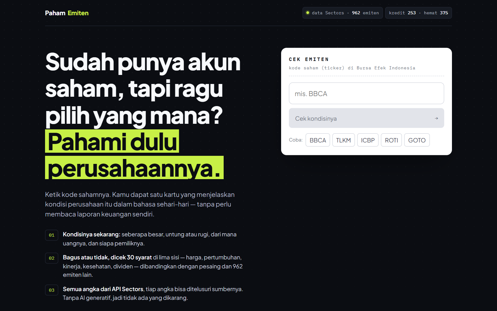

</div>

---

## Untuk juri: 60 detik

- **Masalah.** Jutaan orang membeli Indomie, Pepsodent, dan pulsa Telkomsel tiap minggu tanpa tahu bahwa pemilik merek itu perusahaan terbuka yang bisa mereka pelajari. Aplikasi saham dibuat untuk orang yang *sudah* paham pasar.
- **Yang kami bangun.** Foto struk belanja (atau satu kemasan) → setiap merek dipetakan ke emitennya → **kartu kenalan** yang 100% dibangun dari data Sectors: ukuran perusahaan dalam bahasa awam, peta uang (segmen pendapatan), rantai pemilik sampai grup konglomerasi, dan **pertanyaan kritis** yang dihitung Sectors ke seluruh bursa.
- **Sectors adalah inti.** Jalankan dengan `STRUK_SECTORS_OFF=1` dan semua endpoint menolak: *tidak ada angka tanpa Sectors* (diuji otomatis). Setiap angka di layar bisa dibuka asal-usulnya: endpoint, field, query, waktu ambil.
- **Pemakaian Sectors yang tidak biasa.** Seluruh bursa (962 emiten × 77 field) diambil hanya dengan **25 panggilan Screener**, memanfaatkan `include_query_values`. Total 258 kredit untuk seluruh proyek (termasuk peta uang untuk semua 219 emiten yang punya data segmen); **0 kredit per pengguna**. 9 pola anomali adalah ekspresi `where` Sectors, dan rumus lokal kami dikunci tes agar sama persis dengan `total_count` Sectors.
- **Uang belanjamu mengalir ke siapa.** Harga tiap baris dibaca dari strukmu (bisa kamu koreksi), dijumlah per emiten dan per grup pemilik: *"Dari belanjamu Rp57.100, Rp28.000 (49%) masuk ke Grup Salim lewat ROTI dan ICBP"* — lengkap dengan Sankey dompet → emiten → grup, dan "dari setiap Rp100 pendapatan, laba Rp X" dari Sectors. Hitung ulang tanpa AI, tanpa kredit.
- **AI dipagari kode, bukan imbauan.** AI hanya membaca merek dan harga baris dari strukmu — tidak pernah angka perusahaan. Keluarannya ditolak bila memuat angka atau saran beli/jual. Pada **set uji held-out** (52 baris, ditulis sebelum katalog diperluas): **83% terpetakan benar dan 0 dari 18 merek non-emiten dikarang**; setelah katalog diperluas 98%, dengan satu tebakan AI yang keliru tetap ditandai "dugaan" (tabel di [§3](#ukur-sendiri-seberapa-jujur-pembacaan-struknya)).
- **Bisa diverifikasi.** Demo live di atas · `docker compose up --build` · 115 tes + CI · semua respons Sectors mentah ada di `fixtures/snapshot/`.

---

## Input → Output

### 📦 Foto satu produk → kartu kenalan sahamnya

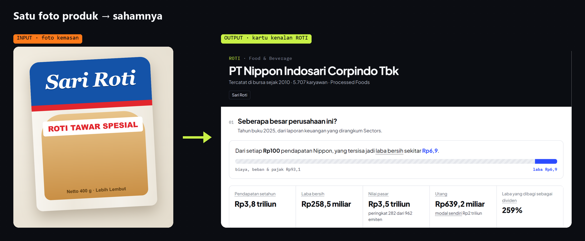

Foto bungkus **Sari Roti Sandwich Cokelat** dari tangan → AI membaca mereknya → katalog mencocokkan ke **ROTI** → dicek ke data Sectors → kartu kenalan PT Nippon Indosari Corpindo Tbk.
Dari setiap Rp100 pendapatannya, hanya sekitar **Rp6,9** yang jadi laba bersih — dan dividennya **259%** dari laba. Itu yang layak ditanyakan.

### 🧾 Foto satu struk → peta pemilik belanjaanmu

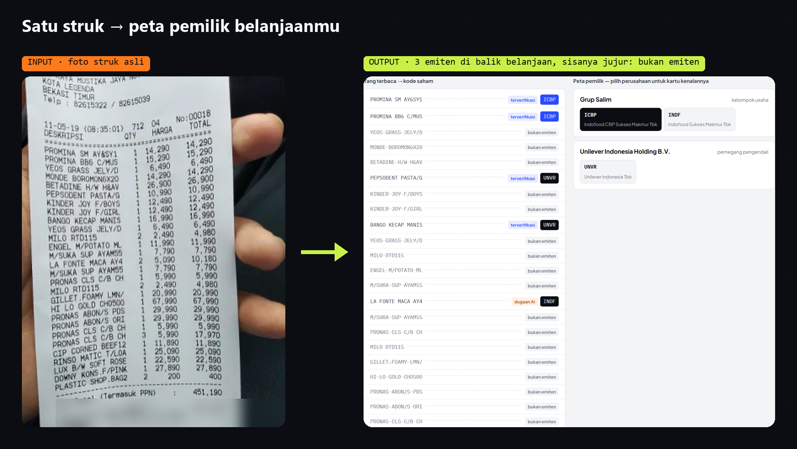

Struk swalayan asli, 28 baris barang, difoto miring dan buram → Promina (ICBP), Pepsodent, Bango, Rinso, Lux (UNVR), La Fonte (INDF, ditandai **dugaan AI**) — **dikelompokkan per pemilik**: ICBP dan INDF sama-sama bermuara ke **Grup Salim**.
Milo, Kinder Joy, Downy, Hi-Lo, Pronas jujur ditandai **bukan emiten** — pemiliknya tidak tercatat di BEI, jadi kami tidak mengarang. Kartu merek **barang** pertama langsung terbuka.

<sub>Input adalah foto asli dari ponsel (nomor kartu pembayaran di struk kami samarkan). Output adalah screenshot asli aplikasi setelah foto itu diunggah lewat jalur foto — tanpa disunting.</sub>

### 💸 Uang belanjamu mengalir ke siapa?

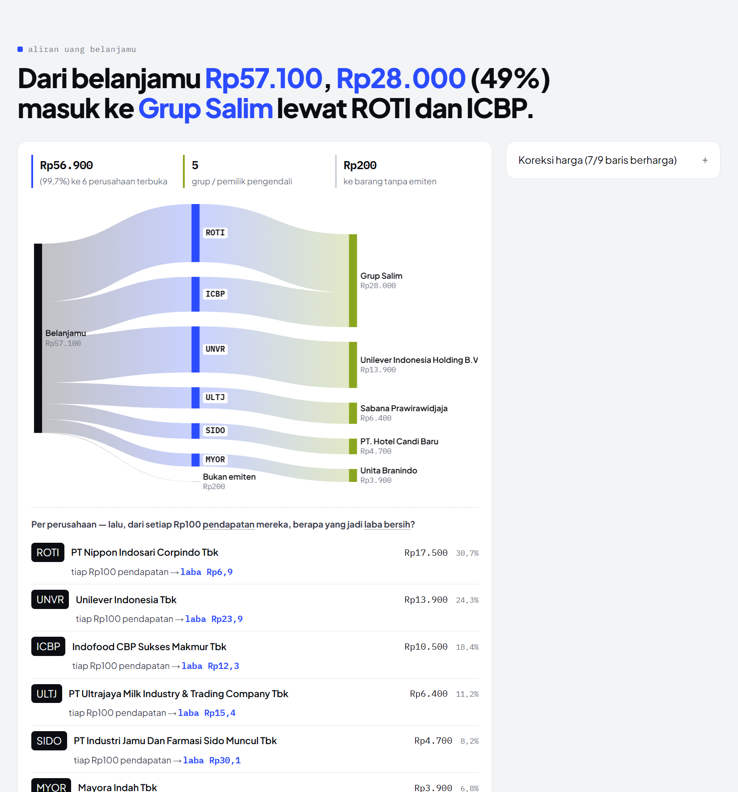

Harga tiap baris dibaca dari **strukmu sendiri**, lalu dijumlah per emiten dan per grup pemilik. Pada contoh ini, hampir separuh belanja Indomaret mengalir ke **Grup Salim** lewat ROTI dan ICBP. Totalnya cocok persis dengan baris bayar di struk (Rp57.100), padahal baris bayar sendiri tidak ikut dihitung. Di sebelah tiap emiten ada angka Sectors *dari setiap Rp100 pendapatan, berapa yang jadi laba bersih*. Harga bisa dikoreksi dan dihitung ulang tanpa AI dan tanpa kredit (`POST /v1/struk/basket`).

Nominal rupiah di bagian ini **bukan** data perusahaan. Harga di rak sudah termasuk bagian toko, distributor, dan pajak, jadi diagram ini menunjukkan *ke merek siapa* uangmu pergi, bukan berapa yang diterima perusahaannya. Halaman juga mengatakannya.

Coba langsung: [contoh Indomaret](https://sectors.muflichlabs.online/?contoh=indomaret&lihat=aliran) · [anak kos sebulan](https://sectors.muflichlabs.online/?contoh=anak-kos&lihat=aliran) · [rumah tangga](https://sectors.muflichlabs.online/?contoh=rumah-tangga&lihat=aliran)

<sub>Screenshot asli: Chrome headless membuka tautan contoh Indomaret di atas, tanpa disunting.</sub>

---

## Isi kartu kenalan

Setiap kartu dibangun 100% dari data Sectors. Contoh di bawah: **ICBP** (Indomie).

<table>
<tr>
<td width="50%"><b>01 · Seberapa besar?</b><br><sub>"Dari setiap Rp100 pendapatan…", peringkat dari 962 emiten, tren 4 tahun</sub><br>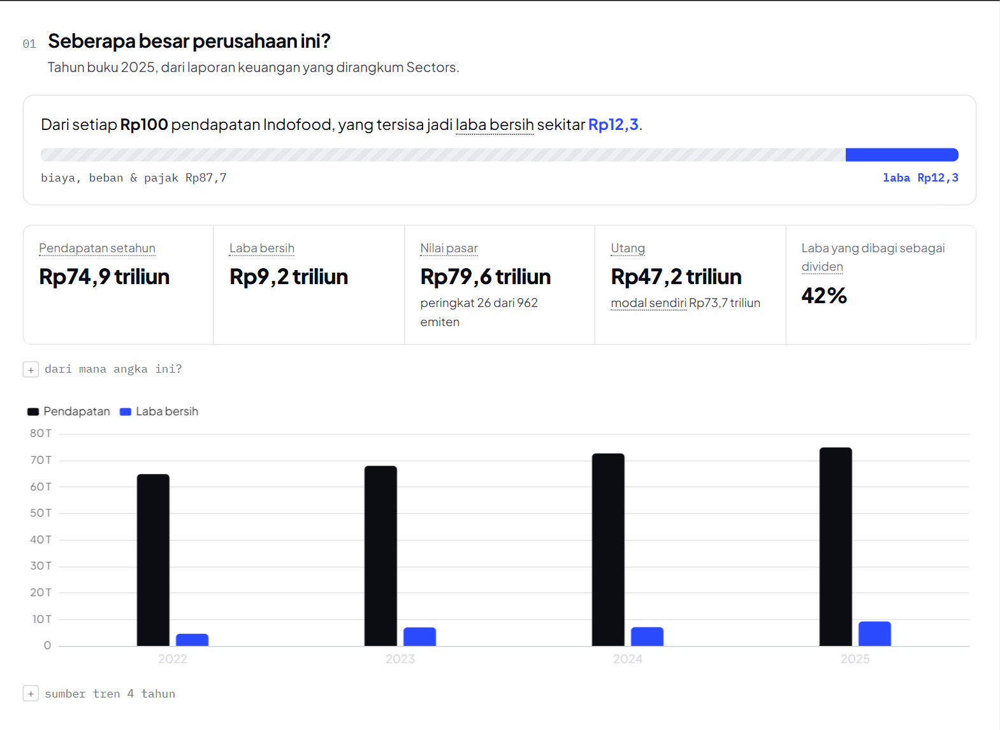</td>
<td width="50%"><b>02 · Peta uang</b><br><sub>Segmen pendapatan → biaya → laba (Sankey dari endpoint segments)</sub><br>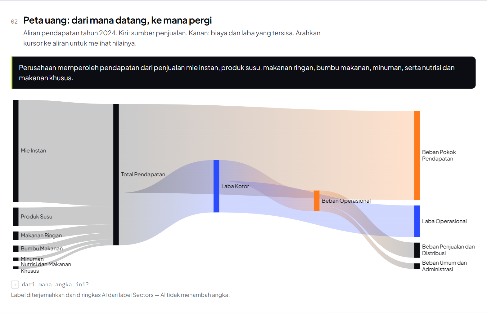</td>
</tr>
<tr>
<td><b>03 · Siapa pemiliknya?</b><br><sub>Porsi publik + rantai pengendali: ICBP ← INDF ← First Pacific → Grup Salim</sub><br>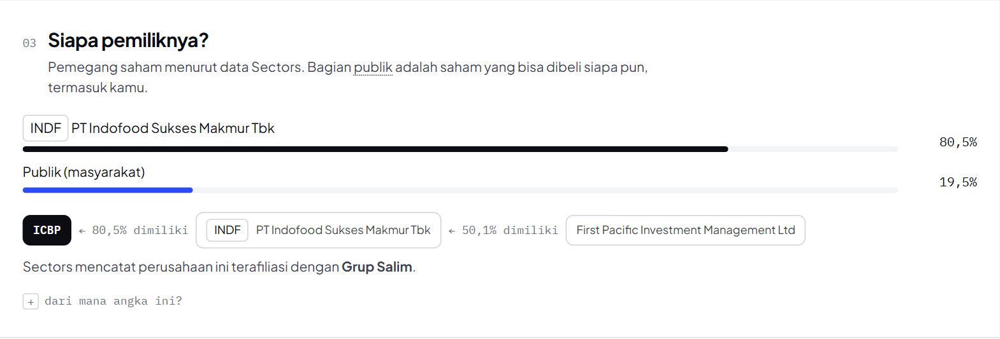</td>
<td><b>05 · Pertanyaan kritis</b><br><sub>Pola dihitung Sectors ke seluruh bursa — "dimiliki 181 dari 962 perusahaan"</sub><br>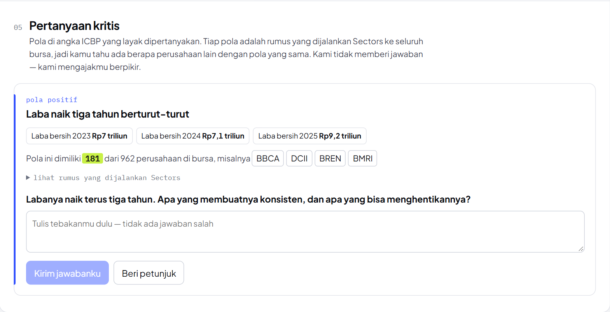</td>
</tr>
</table>

<details>
<summary><b>📱 Tampilan ponsel</b></summary>
<br>
<p align="center">
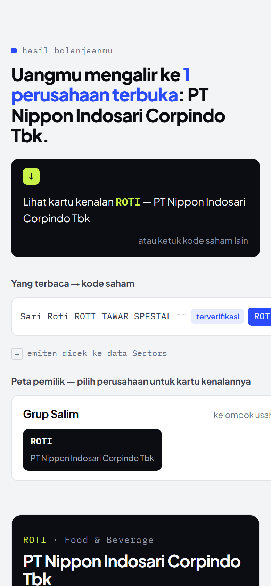&nbsp;&nbsp;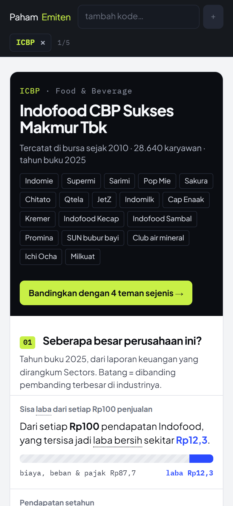
</p>
</details>

---

## 1. Masalahnya

Jutaan orang Indonesia membeli Indomie, Pepsodent, pulsa Telkomsel, dan GoFood setiap minggu, tapi tidak tahu bahwa merek-merek itu dimiliki perusahaan yang sahamnya bisa mereka pelajari — bahkan beli. Aplikasi saham dibuat untuk orang yang *sudah* paham pasar. Pemula yang kritis dan penasaran tidak punya pintu masuk.

**Struk Jadi Saham** memakai benda yang semua orang punya — struk belanja, atau bungkus produk di meja — sebagai pintu masuk itu.

**Insight turunan, bukan data mentah** (track Market Intelligence): 9 detektor anomali berbasis aritmatika Screener + ukuran kohort seluruh bursa, peringkat dari 962 emiten, rasio "per Rp100 pendapatan", perbandingan se-industri, dan rantai pengendali yang ditelusuri dari data pemegang saham.

## 2. Cara kerjanya

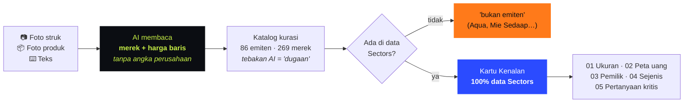
```mermaid
flowchart LR
    A["📷 Foto struk<br>📦 Foto produk<br>⌨️ Teks"] --> B["AI membaca<br><b>merek + harga baris</b><br><i>tanpa angka perusahaan</i>"]
    B --> C["Katalog kurasi<br>86 emiten · 269 merek<br><i>tebakan AI = 'dugaan'</i>"]
    C --> D{"Ada di data<br>Sectors?"}
    D -- tidak --> E["'bukan emiten'<br>(Aqua, Mie Sedaap…)"]
    D -- ya --> F["Kartu Kenalan<br><b>100% data Sectors</b>"]
    F --> G["01 Ukuran · 02 Peta uang<br>03 Pemilik · 04 Sejenis<br>05 Pertanyaan kritis"]
    style B fill:#0b0d12,color:#c8f046,stroke:#0b0d12
    style F fill:#2b4bff,color:#fff,stroke:#2b4bff
    style E fill:#ff7a1a,color:#0b0d12,stroke:#ff7a1a
```

| Bagian kartu | Isi | Sumber Sectors |
|---|---|---|
| 01 Seberapa besar | Pendapatan, laba, nilai pasar + peringkat dari 962 emiten, utang vs modal, dividen, tren 4 tahun, **"dari setiap Rp100 pendapatan, sisa laba Rp X"** | Screener `include_query_values` (matriks seluruh bursa) |
| 02 Peta uang | Diagram Sankey: segmen pendapatan → biaya → laba (rugi ditandai tangerine) | `/v2/company/get-segments/{symbol}/` |
| 03 Siapa pemiliknya | Pemegang saham, porsi publik, rantai pengendali (ICBP ← 80,5% INDF ← 50,1% First Pacific → Grup Salim) | `major_shareholders`, `affiliates` dari Screener |
| 04 Teman sejenis | Perbandingan dengan emiten se-industri | Matriks Screener |
| 05 Pertanyaan kritis | Pola anomali + berapa emiten lain di bursa dengan pola sama + pertanyaan Sokratik | **Ekspresi aritmatika `where` Screener** |

### Pertanyaan kritis = rumus yang dijalankan Sectors ke seluruh bursa

Setiap pola adalah ekspresi `where` Screener Sectors, ditampilkan apa adanya ke pengguna sebagai bukti:

| Pola | `where` |
|---|---|
| Penjualan naik, tapi laba turun | `revenue[2025] > revenue[2024] and earnings[2025] < earnings[2024]` |
| Laba turun dua tahun berturut-turut | `earnings[2025] < earnings[2024] and earnings[2024] < earnings[2023]` |
| Utang lebih besar dari modal sendiri | `total_debt[2025] > total_equity[2025]` |
| Dividen lebih besar dari laba | `payout_ratio > 1` |
| Rugi di tahun 2025 | `earnings[2025] < 0` |
| Untung di atas kertas, kas operasi minus | `operating_cash_flow[2025] < 0 and earnings[2025] > 0` |
| Margin laba bersih anjlok > 30% | `net_profit_margin[2024] > 0 and net_profit_margin[2025] < net_profit_margin[2024] * 0.7` |
| Laba naik tiga tahun berturut-turut | `earnings[2023] > 0 and earnings[2024] > earnings[2023] and earnings[2025] > earnings[2024]` |
| Penjualan melonjak > 20% | `revenue[2024] > 0 and revenue[2025] > revenue[2024] * 1.2` |

`pagination.total_count` dari Sectors menjadi konteks kohort ("pola ini dimiliki **181** dari 962 perusahaan"). Pengguna menulis tebakannya; AI pendamping menanggapi **tanpa angka dan tanpa saran beli/jual** (dijaga kode, bukan imbauan).

## 3. Kenapa Sectors adalah inti, bukan hiasan

**Uji copot:** jalankan Core dengan `STRUK_SECTORS_OFF=1` — semua endpoint menolak dengan
`"Tanpa data Sectors, aplikasi ini tidak bisa menampilkan apa pun — kami tidak mengarang angka."`
Tidak ada fallback angka dari AI.
 Ini diuji otomatis (`test_sectors_off_kills_the_app`).

Peran AI sengaja sempit:

| Peran | Yang boleh | Penjaga |
|---|---|---|
| `struk_parse` | baca nama merek dari foto/teks | skema JSON ketat; injeksi di struk diabaikan |
| `struk_explain` | terjemahkan label segmen Sectors + 1 kalimat ringkasan | output ditolak bila ada digit atau frasa rekomendasi |
| `struk_reflect` | tanggapi jawaban pengguna | output ditolak bila ada digit atau frasa rekomendasi → fallback deterministik |

Model: `google/gemini-3.8-flash` via OpenRouter, `reasoning_effort=low`.

### Ukur sendiri: seberapa jujur pembacaan struknya?

Dua set uji, ditulis seperti singkatan kasir (`TEH PUCUK HRM 350ML`, `SO GOOD SOSIS 375G`) beserta kunci jawabannya. Sepertiga baris sengaja berisi merek yang pemiliknya **tidak** tercatat di BEI (Aqua, Sedaap, Downy, Panadol, Oreo, Netflix, …): jebakan untuk melihat apakah aplikasi mengarang emiten.

**Set B — held-out** (`fixtures/eval/struk_eval_b.json`, 52 baris dari 4 struk: apotek, Alfamart, rumah tangga, gaya hidup). Ditulis *sebelum* katalog diperluas; kegagalannya tidak dipakai untuk menambal katalog.

| Set B | Baris benar | Emiten ditemukan | Merek non-emiten dikarang jadi emiten | Emiten salah |
|---|---|---|---|---|
| Katalog lama saja (tanpa AI) | 37/52 (71%) | 19/34 (56%) | 0/18 (0%) | 0 |
| **Aplikasi, katalog lama — angka held-out yang jujur** | **43/52 (83%)** | **25/34 (74%)** | **0/18 (0%)** | **0** |
| Aplikasi, katalog diperluas | 51/52 (98%) | 34/34 (100%) | 1/18 (6%) | 0 |

Dibaca dengan jujur: baris pertama dan kedua adalah kemampuan aplikasi pada merek yang **belum pernah dilihat**. Baris ketiga tidak lagi held-out, karena katalog dan set B ditulis dari pengetahuan yang sama. Pada baris ketiga, AI menebak `NEOZEP` (Medifarma, bukan emiten) sebagai DVLA. Tebakan itu tetap tampil sebagai **dugaan AI**, bukan terverifikasi, karena status verifikasi melekat per baris. Satu label diubah setelah run pertama dan diungkap di file: Sports Station kini menerima MAPA (operator) atau MAPI (induk). Hasil run pertama disimpan utuh di `struk_eval_b_result_before_catalog.json`.

**Set A** (`fixtures/eval/struk_eval.json`, 59 baris dari 6 struk) adalah set pengembangan. Aplikasi kini 59/59 dan 0/18 merek dikarang. Satu-satunya kegagalan sebelumnya, `BODREX` (TSPC), tertutup karena Tempo Scan masuk katalog, jadi set ini tidak lagi mengukur merek tak dikenal.

Ulangi sendiri: `python tools/eval_struk.py --set b` (0 kredit Sectors, 1 panggilan AI per struk). Hasil per baris ada di `fixtures/eval/struk_eval*_result.json`.

## 4. Pemakaian Sectors API yang hemat (dan tidak biasa)

Seluruh bursa (962 emiten × 77 field) diambil hanya dengan **25 panggilan Screener**, memanfaatkan fakta bahwa
`include_query_values=true` mengembalikan *setiap* field yang disebut di `where` — termasuk cabang `OR` dan field per-tahun:

```
where = symbol like '%' or revenue[2022] > -1e18 or revenue[2023] > -1e18 or … or affiliates in ['Salim'] or …
limit = 200, order_by = symbol, include_query_values = true      → 5 halaman × 5 grup field = 25 kredit
```

Kebenaran rumus lokal dikunci tes: untuk **setiap** pola, evaluasi Python atas matriks harus sama persis dengan `total_count` yang dihitung Sectors (`test_local_rule_matches_sectors_screener_count`, 9 pola).

### Anggaran kredit (saldo awal tim 490)

| Tahap | Panggilan | Kredit |
|---|---|---|
| Validasi asumsi (`tools/validate_api.py`): aritmatika `where`, field list, suffix `.JK`, daftar segmen | 4 | 4 |
| Harvest matriks seluruh bursa | 10 | 10 |
| Harvest segmen pendapatan, tahap 1 (43 emiten konsumen) | 43 | 43 |
| Harvest segmen pendapatan, tahap 2 (176 emiten sisanya — semua 219 yang punya segmen di Sectors) | 176 | 176 |
| Harvest kohort 9 pola | 9 | 9 |
| Probe cakupan data untuk 30 cek ala Snowflake (`tools/probe_snowflake.py`) | 1 | 1 |
| Harvest matriks tahap 2: 44 field baru (valuasi, forecast, riwayat 2020–2025, kesehatan, bank) untuk 30 cek ala Snowflake | 15 | 15 |
| **Runtime aplikasi (setiap scan, kartu, pertanyaan)** | **0** | **0** |
| **Total** | 258 | **258** → sisa **232** |

Semua respons mentah disimpan di `fixtures/snapshot/` (±5,3 MB, data Sectors asli) dan di-*seed* ke Store saat start. Aplikasi berjalan di mode `offline` — tidak ada panggilan live, tidak ada kredit terbakar saat demo atau saat juri mencoba. Chip di header menampilkan kredit terpakai vs dihemat secara jujur.

### Buku resep hemat kredit

Aturan tim: setiap panggilan Sectors baru dicatat di tabel anggaran di atas **dan** caranya ditulis di sini. Prinsipnya satu: **satu kredit harus menjawab sebanyak mungkin pertanyaan**.

| # | Trik | Caranya | Kredit kami | Cara biasa |
|---|---|---|---|---|
| 1 | **Matriks seluruh bursa** | `where = symbol like '%' or <field> > -1e18 or …` + `include_query_values=true`, `limit=200`. Cabang `symbol like '%'` membuat semua emiten lolos, dan cabang `OR` lain hanya ada agar nilainya ikut dikembalikan. | **25** untuk 962 emiten × 77 field (termasuk daftar lengkap pemegang saham). Menambah 44 field baru hanya menambah 3 grup = **15 kredit**, bukan 962. | ≥962 per kelompok field (satu per emiten), atau 7.696 bila memakai Company Report 8 seksi |
| 2 | **Probe cakupan data** | Trik yang sama, 15 field kandidat sekaligus. Hitung berapa persen yang terisi dari 200 baris (`tools/probe_snowflake.py`). Hasil: data mulai sekitar 2020, forecast analis hanya ±15% emiten, `intrinsic_value`/`peg`/`pe_peer_avg` ±90%. Karena itu harvest berikutnya tidak membayar kolom tahun 2015–2019 yang kosong, dan cek 10 tahun Snowflake diganti 5 tahun dengan jujur. | **1** untuk 15 field | 15 (satu query hitung per field) |
| 3 | **Ukuran kohort dari `total_count`** | Satu `where` per pola anomali, `limit=10`. `pagination.total_count` = jumlah emiten se-bursa dengan pola itu, dan 10 baris teratas jadi contoh. Rumus lokal kemudian dikunci tes agar sama dengan angka Sectors, sehingga pola berikutnya bisa dihitung lokal dari matriks. | **1** per pola | Menarik semua baris lalu menghitung sendiri (5 kredit per pola) |
| 4 | **Cek daftar dulu, baru ambil detail** | `list_companies_with_segments` (1 kredit) → hanya 219 emiten yang benar-benar punya segmen yang dipanggil. Menurut docs Sectors, respons **404 tetap ditagih**, jadi mencoba semua simbol itu mahal. | **1 + 219** | 962 bila semua emiten dicoba |
| 5 | **Jangan pakai `q=`** | Bahasa alami di Screener memakan 3 kredit. Ekspresi `where` terstruktur 1 kredit dan hasilnya bisa diulang persis. | 1 | 3 |
| 6 | **Hindari Company Report penuh** | Report dihitung 1 kredit **per seksi** (default 8). Semua yang kami butuhkan sudah ada di matriks Screener, jadi kami tidak memanggilnya sama sekali. | 0 | 8 per emiten |
| 7 | **Runtime nol kredit** | Store read-through cache + ledger. Semua respons mentah disimpan di `fixtures/snapshot/` lalu di-*seed*, dan aplikasi berjalan `offline`. | **0** per pengguna | 1+ per tampilan |
| 8 | **Dry-run dan batas anggaran** | Setiap script punya `--dry` (estimasi, 0 kredit) dan `--budget` (berhenti sebelum melewati anggaran). | — | — |

**Kapan kredit terpakai** (tabel penagihan di docs Sectors): respons **2xx dan 404 ditagih**. Respons 400, 401/403, 429, dan 5xx **gratis**. Jebakan yang kami temui:
- Filter `symbol in [...]` tanpa suffix `.JK` menghasilkan 200 kosong, dan **tetap ditagih**.
- Cloudflare menolak UA `Python-urllib` (403, gratis), jadi pakai UA kustom.
- `listing_date` harus dibandingkan sebagai tanggal, bukan dengan `like`.
- Panggilan beruntun kena 429 (gratis), jadi beri jeda `--sleep`.

## 5. Arsitektur

```
apps/web    Next.js 14 + ECharts   — halaman Struk Jadi Saham (/), proxy /api/core/*
apps/core   FastAPI                — app/struk/: universe (matriks), rules (9 pola), brands (katalog),
                                     service (kartu, pemilik, kohort, keranjang), narrate (3 peran AI)
apps/store  FastAPI + SQLite       — Sectors Call Store: read-through cache, ledger kredit, mode offline,
                                     seed snapshot, passthrough /sectors/v2/* dengan biaya kanonis
fixtures/snapshot   respons Sectors asli (matrix/, segments/, cohorts/)
tools/harvest.py    pengambil snapshot (--dry dulu, --budget, --sleep)
```

Setiap angka di UI membawa provenans yang bisa dibuka ("dari mana angka ini?"): endpoint Sectors, field, query, waktu ambil, dan kredit untuk tampilan itu.

## 6. Menjalankan

Cara tercepat, satu perintah (butuh Docker saja):

```bash
docker compose up --build       # → http://127.0.0.1:3000
```

Tanpa Docker:

```bash
make setup                      # venv Python + deps Node (butuh uv)
cp .env.example .env            # isi OPENROUTER_API_KEY untuk baca foto struk
make dev                        # Store :8787 + Core :8788 + Web :3000
# buka http://127.0.0.1:3000
```

- `IDXMACA_STORE_MODE=offline` (default) → hanya snapshot, 0 kredit Sectors. `SECTORS_API_KEY` tidak dibutuhkan untuk menjalankan aplikasi.
- Demo publik (`PUBLIC_DEMO=1`): proxy hanya membuka endpoint Struk, dan AI dibatasi kuota per pengunjung + per hari (`apps/core/app/struk/quota.py`). Saat kuota habis, input teks otomatis memakai katalog deterministik; data Sectors tidak pernah ikut terbatasi.
- Tanpa `OPENROUTER_API_KEY`: input teks tetap jalan (pencocokan katalog deterministik), label peta uang tampil dalam bahasa Inggris asli Sectors; input foto butuh key.
- Uji copot Sectors: `STRUK_SECTORS_OFF=1 make dev`.

Memperbarui snapshot (memakai kredit, selalu dry-run dulu):

```bash
.venv/bin/python tools/harvest.py --dry                    # estimasi kredit, 0 panggilan
IDXMACA_STORE_MODE=live .venv/bin/python tools/harvest.py --budget 70 --sleep 3
```

Tes:

```bash
make test        # 115 tes Store + Core, termasuk tes Struk Jadi Saham terhadap snapshot Sectors asli
```

CI (GitHub Actions) menjalankan tes yang sama, ditambah typecheck dan build web serta build image Docker, di setiap push.

## 7. Batasan yang kami akui

- Katalog merek dikurasi manual (86 emiten, 269 merek). Merek di luar katalog bisa ditebak AI tapi ditandai **dugaan**; merek milik perusahaan tertutup (Aqua, Mie Sedaap, Sosro) jujur ditandai **bukan emiten**.
- Harga di "aliran uang" berasal dari struk pengguna dan bisa salah baca; karena itu harga selalu bisa dikoreksi. Nominal itu adalah belanja konsumen, bukan pendapatan perusahaan.
- Peta uang tersedia untuk ke-219 emiten yang punya data segmen di Sectors (seluruhnya sudah kami ambil); emiten lain menampilkan kotak kosong yang jujur, bukan angka karangan.
- Snapshot bertanggal 6 Oktober 2026, tahun buku 2025.
- Alat informasi dan analisis, **bukan rekomendasi investasi**.

## 8. Riwayat

Repo ini berawal dari **IDXMACA** (asisten multi-agen untuk analis), masih tersedia di `/idxmaca` — dokumentasinya di [`docs/IDXMACA.md`](docs/IDXMACA.md). Kami beralih ke Struk Jadi Saham karena IDXMACA menghabiskan kredit per pertanyaan; arsitektur Store-nya dipakai ulang di sini sehingga runtime menjadi 0 kredit.
