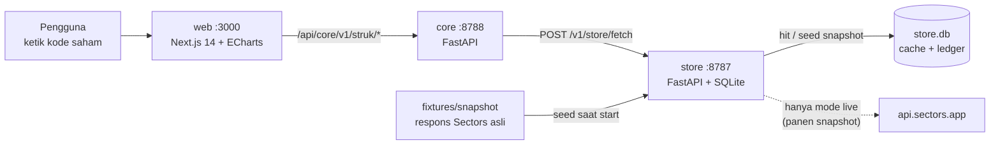

# Arsitektur Paham Emiten

Dokumen ini menjelaskan bagaimana satu kode saham berubah menjadi kartu emiten, dan di mana Sectors berada di dalamnya. Pengantar produk ada di [README](../README.md); aturan cache dan kredit ada di [STORE.md](STORE.md) dan [CREDITS.md](CREDITS.md).

## Gambaran



| Layanan | Folder | Tugas |
|---|---|---|
| **web** | `apps/web` | Halaman Paham Emiten (`/`), kartu 1 emiten dan kolom perbandingan 2–5 emiten, grafik ECharts. Route `app/api/core/[...path]` mem-proxy ke Core. |
| **core** | `apps/core/app/struk` | Merakit kartu dari data Sectors: matriks seluruh bursa, 30 cek lima sisi, rantai pemilik, pesaing, peta uang. Tanpa LLM. |
| **store** | `apps/store` | Satu-satunya pintu ke Sectors: cache read-through, ledger kredit, mode offline, seed dari snapshot. Hanya Store yang boleh memegang `SECTORS_API_KEY`. |

Core tidak punya API key Sectors sama sekali. Aturan ini ditegakkan oleh struktur layanan, bukan oleh imbauan.

## Dari kode saham ke kartu

1. **Pencarian** (`GET /v1/struk/search?q=BB`). Mencocokkan kode persis, lalu kode yang diawali ketikan. Semuanya dari matriks yang sudah di memori, jadi 0 kredit.
2. **Kartu** (`GET /v1/struk/company/{kode}`). `service.company_card` memanggil `load_universe()` lalu merakit:

| Bagian respons | Dibangun dari |
|---|---|
| `facts`, `trend` | Field `revenue`, `earnings`, `net_profit_margin`, `market_cap`, `total_debt`, `total_equity`, `roe`, dan seterusnya dari matriks. Rasio *"dari setiap Rp100 pendapatan"* = `net_profit_margin × 100`. |
| `money` | Endpoint `get-segments` (peta uang). Hanya dipanggil bila simbol ada di `list_companies_with_segments` (219 emiten), karena 404 tetap ditagih. |
| `owners` | `major_shareholders_share_percentage`, `affiliates`, `free_float`. `controller_chain` mengikuti pemegang terbesar yang bukan publik, melompat ke emiten induk bila Sectors menautkan simbolnya. |
| `peers` | Emiten satu `industry` (mundur ke `sub_sector` bila kurang dari 4), diurutkan menurut nilai pasar. |
| `snowflake` | `snowflake.evaluate`: 30 cek ya/tidak (lihat di bawah). |

3. Setiap blok membawa `src`: endpoint Sectors, field, query, waktu ambil, sumber (`store-hit`, dst.), dan kredit untuk tampilan itu. UI menampilkan ini sebagai "dari mana angka ini?".

## Matriks seluruh bursa

`struk/universe.py` mendefinisikan lima grup field (`profile`, `fin`, `value`, `hist`, `health`; total 77 field, tahun buku 2022–2025, riwayat dari 2020, perkiraan 2026). Untuk tiap grup, `load_universe()` memanggil Screener `GET /v2/companies/` dengan:

```
where               = symbol like '%' or <field> > -1e18 or …
limit               = 200
order_by            = symbol
include_query_values = true
```

Cabang `symbol like '%'` meloloskan semua emiten. Cabang `OR` lainnya ada supaya `query_values` mengembalikan nilai setiap field yang disebut. Hasilnya 5 halaman × 5 grup = **25 panggilan untuk 962 emiten × 77 field**. `merge_pages` menggabungkannya per simbol. Hasil disimpan di memori proses (`_UNIVERSE`) setelah panggilan pertama.

## Lima sisi: 30 cek

`struk/snowflake.py`: 5 sisi (Harga, Prospek, Rekam jejak, Kesehatan, Dividen) × 6 cek, diadaptasi dari [model analisis terbuka Simply Wall St](https://github.com/SimplyWallSt/Company-Analysis-Model).

- Setiap `Check` punya `fields` (field Sectors yang dipakai), fungsi `test`, dan `where`: ekspresi Screener setara yang ditampilkan di layar dan bisa dijalankan ulang.
- `compute_stats` menghitung pembanding sekali dari matriks: median PER bursa, median perkiraan pertumbuhan laba dan pendapatan bursa, persentil ke-25 dan ke-75 imbal hasil dividen (hanya yang membayar), serta median pertumbuhan laba dan ROA per kelompok pembanding (industri bila beranggota ≥4, selain itu subsektor). Tidak ada panggilan Sectors tambahan.
- Hasil tiap cek: `true` (lolos), `false`, atau `null` ("tidak bisa dinilai" bila data Sectors kosong). `null` tidak dihitung gagal.
- `market_pass` per cek = jumlah emiten yang lolos, dihitung lokal dari matriks (*"lolos oleh N dari 962"*).
- Bank (`is_bank`: subsektor Banks atau punya `gross_loan`) memakai 4 cek khusus bank (`BANK_ONLY`: NPL, LDR, leverage aset/modal, CAR) sebagai pengganti 6 cek kesehatan non-bank (`NON_BANK_HEALTH`).
- Emiten yang tidak membayar dividen (`pays_dividend` salah: imbal hasil 0 dan tidak ada dividen 2020–2025) **tidak lolos** cek dividen yang mensyaratkan dividen. Ini hasil `false`, bukan `null`.

Tes `apps/core/tests/test_snowflake.py` mengunci hasil terhadap angka asli di snapshot.

## Uji copot Sectors

`STRUK_SECTORS_OFF=1` membuat `service.load_universe()` dan `_fetch()` melempar `SectorsOff`. Endpoint `/v1/struk/*` lalu mengembalikan `sectors_off: true` dengan pesan *"Tanpa data Sectors, aplikasi ini tidak bisa menampilkan apa pun — kami tidak mengarang angka."* Tidak ada sumber angka cadangan. Dikunci oleh tes `test_sectors_off_kills_the_app`.

## Satu-satunya pengetahuan non-Sectors

`struk/brands.py` berisi katalog kurasi 86 emiten → merek sehari-hari (ICBP → Indomie, …). Dipakai hanya untuk chip di kepala kartu. Semua angka, pemilik, dan segmen hanya dari Sectors.

## Endpoint

**Core (`:8788`)**

| Endpoint | Fungsi |
|---|---|
| `GET /v1/struk/search?q=` | Saran kode saham (persis atau awalan) |
| `GET /v1/struk/company/{kode}` | Kartu emiten lengkap dengan `src` per blok |
| `GET /v1/struk/status` | Status `sectors_off`, statistik Store, disclaimer |
| `GET /v1/health` | Health check |

Route proxy web (`apps/web/app/api/core/[...path]`) hanya meneruskan GET ke Core, jadi browser cukup bicara ke satu origin.

**Store (`:8787`)**: lihat [STORE.md](STORE.md).

## Perbandingan 2–5 emiten

Tidak ada endpoint khusus. Browser mengambil kartu tiap kode lewat `/v1/struk/company/{kode}`, menyimpannya per kode di state halaman, lalu menyusun kolom berdampingan. Menambah kolom tidak mengambil ulang kartu yang sudah ada, dan tidak ada angka baru di luar kartu. Tautan `/?emiten=BBCA,BBRI` membuka perbandingan langsung.

## Data dan reproduksibilitas

| Lokasi | Isi |
|---|---|
| `fixtures/snapshot/matrix/` | 25 respons Screener mentah (matriks seluruh bursa) |
| `fixtures/snapshot/segments/` | `_list.json` + respons segmen per emiten |
| `fixtures/snapshot/cohorts/` | Respons `total_count` dari fitur awal yang sudah dihapus; dipertahankan sebagai bukti panen |
| `fixtures/validation/` | Respons mentah dari `tools/validate_api.py` dan `tools/probe_snowflake.py` |

`tools/harvest.py` mengambil snapshot lewat Store (mode live). Saat start, Store membaca `fixtures/snapshot/**/*.json` dan mengisi cache tanpa mencatat kredit, sehingga aplikasi berjalan penuh di mode `offline` dengan 0 kredit.

## Riwayat

Repo ini berawal dari **IDXMACA**, asisten multi-agen berbasis LLM. Seluruh kodenya (agen, LLM, halaman `/idxmaca`, mode fixture Store) sudah dihapus dan hanya tersisa di riwayat git. Yang dipakai ulang hanya arsitektur Store (cache read-through + ledger kredit).
