# Contoh Alur 14 Pain Points — Query User sampai Output Final

> Pendamping: `pain-points-ritel.md` · `jev.md` · `PRD.md` · `mermaid.md`
> **SEMUA ANGKA DI FILE INI FIKSI / ILUSTRASI**, hanya untuk menunjukkan data apa yang berpindah antar tahap. Bukan data real, bukan rekomendasi investasi.

Legenda bentuk: ([/../]) hexagon = model AI · ["..."] kotak = code milik tim · [("...")] silinder = data Sectors · ({"..."}) diamond = keputusan Jev · (["..."]) stadium = user/output.

Alur baku tiap diagram: Query user → Jev route/guard → Sectors fetch → Compute code → Jev judge → Gemini narasi → Jev verify → Output final.

---

## PP-01 — Screening 900+ emiten

**Query user:** `Cariin saham bank dividen di atas 5 persen, PBV di bawah 1,5. Modalku 5 juta, aku konservatif.`

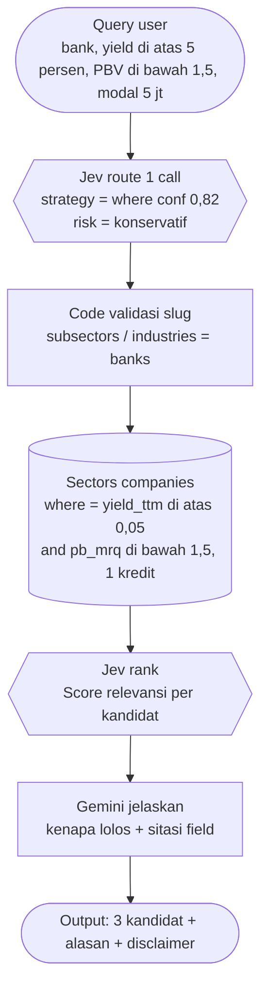

| Tahap | Contoh data yang berpindah |
|---|---|
| Route | `strategy=where (0,82)`, `risk_score=0,3 konservatif`, `need_clarify=false` |
| Fetch | `where=yield_ttm>0.05 and pb_mrq<1.5 and roe_ttm>0.1` → 3 emiten + field `pe_ttm, pb_mrq, roe_ttm, yield_ttm, payout_ratio, esg_score, intrinsic_value` |
| Judge | relevance `BANK-A 0,91 / BANK-B 0,76 / BANK-C 0,58` |
| Verify | semua angka cocok payload, 1 kredit terpakai |

**Output final (ilustrasi):** `3 bank lolos: BANK-A (yield 6,1%, PBV 1,2, ROE 14%) paling cocok untuk profil konservatif karena payout 55% masih aman... [sitasi field per angka]. Bukan rekomendasi investasi.`

---

## PP-02 — Istilah LK membingungkan

**Query user:** `EBITDA itu apa sih? Terus EBITDA BBRI trennya gimana?`

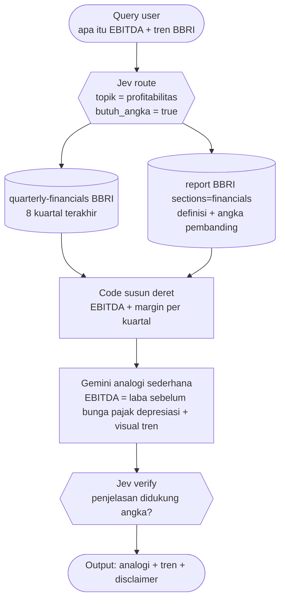

| Tahap | Contoh data yang berpindah |
|---|---|
| Fetch | 8 kuartal EBITDA `11,2T → 12,8T`, margin `44% → 47%`, periode via `quarterly-dates` |
| Narrate | analogi `kas yang dihasilkan operasi inti`, catatan `bukan laba bersih` |
| Verify | `didukung=0,93`, `over_simplifikasi=0,18 rendah` |

**Output final (ilustrasi):** `EBITDA itu ibarat uang kas yang dihasilkan bisnis intinya, sebelum bayar bunga-pajak... BBRI naik pelan 8 kuartal (margin 44 ke 47%). Ingat: EBITDA bukan laba bersih... Bukan rekomendasi investasi.`

---

## PP-03 — Laporan tahunan 300 halaman

**Query user:** `Aku cuma punya 10 menit. Ringkasin laporan tahunan BBCA yang penting aja.`

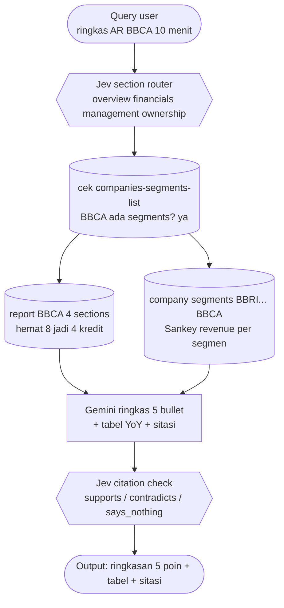

| Tahap | Contoh data yang berpindah |
|---|---|
| Route | sections terpilih 4 dari 8, estimasi hemat 4 kredit |
| Fetch | laba bersih `54,8T (+11% YoY)`, NIM `5,7%`, segmen konsumer 38% revenue |
| Verify | 5 klaim `verified (conf 0,88-0,97)`, 1 klaim `unsupported → review, ditahan` |

**Output final (ilustrasi):** `5 hal penting BBCA: 1) laba 54,8T naik 11%... 4) segmen konsumer 38%... [sitasi section per angka]. 1 klaim saya tahan karena tak didukung dokumen. Bukan rekomendasi investasi.`

---

## PP-04 — Komparasi 4 bank apple-to-apple

**Query user:** `Bandingin BBCA BBRI BMRI BBNI. Mana yang paling efisien dan valuasinya masuk akal?`

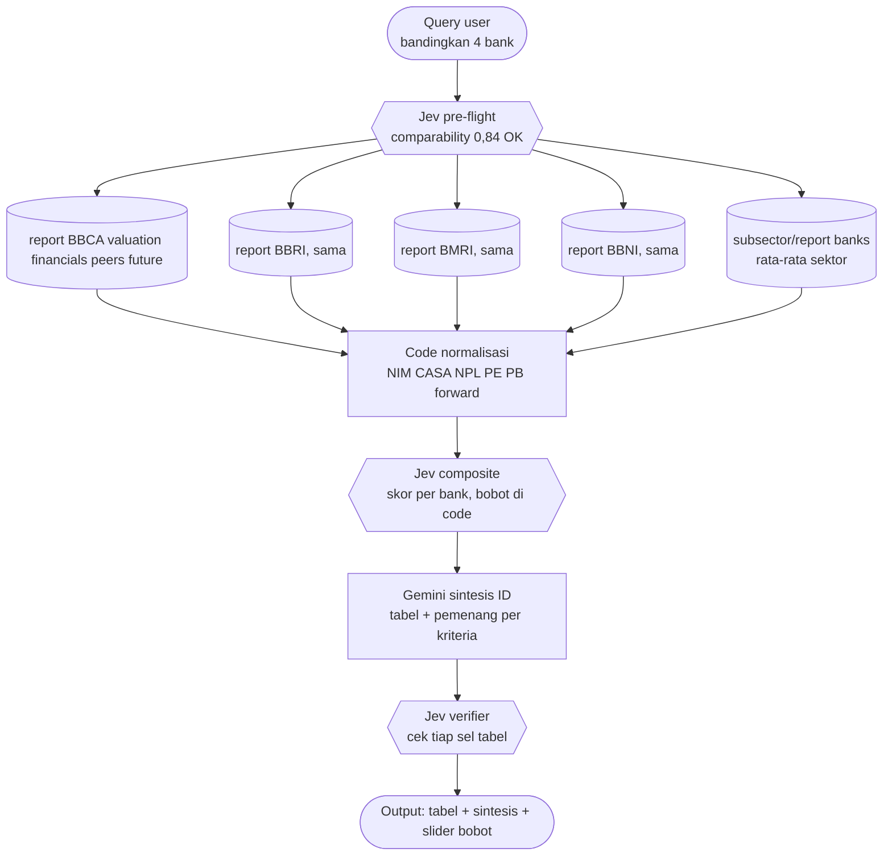

| Tahap | Contoh data yang berpindah |
|---|---|
| Fetch | per bank: NIM `5,7 / 6,9 / 5,9 / 4,8`, CASA `81 / 64 / 72 / 70`, NPL `1,9 / 2,8 / 1,2 / 2,1`, forward PE `19 / 11 / 10 / 8`, rating analis |
| Judge | composite `BBCA 0,81 / BBRI 0,74 / BMRI 0,77 / BBNI 0,66` (bobot default) |
| Verify | 16 sel tabel `verified`, 0 ditahan |

**Output final (ilustrasi):** `Tabel 4 bank... Paling efisien: BBRI (NIM 6,9%) tapi NPL tertinggi 2,8%. Valuasi termurah relatif: BBNI (forward PE 8x). Geser slider ke konservatif → peringkat berubah... Bukan rekomendasi investasi.`

---

## PP-05 — Murah vs value trap siklikal

**Query user:** `ITMG PER-nya cuma 4x, murah banget kan? Gas beli?`

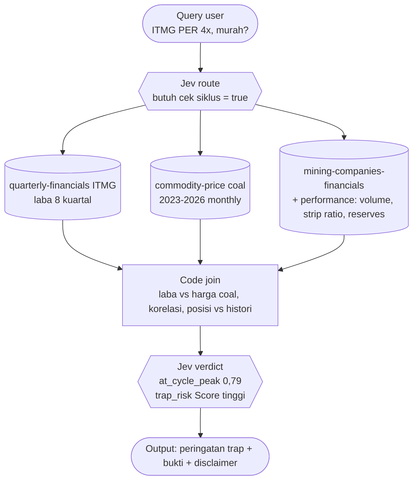

| Tahap | Contoh data yang berpindah |
|---|---|
| Fetch | PER `4,1x`, EPS `38.200`, harga coal `148 USD/ton (vs rata 3 thn 112)`, volume flat, strip ratio naik |
| Compute | korelasi laba-coal `0,91`, laba di persentil `95` histori (puncak) |
| Judge | `verdict=trap (0,74)`, `at_cycle_peak=0,79` |

**Output final (ilustrasi):** `Hati-hati: PER 4x-nya terbentuk karena labanya lagi di puncak (coal 148 vs rata-rata 112). Kalau coal balik ke rata-rata, PER-nya bisa jadi 9-10x. Ini ciri value trap siklikal... Bukan rekomendasi investasi.`

---

## PP-06 — Dividen trap yield 12%

**Query user:** `Saham KOPI yield 12 persen, aman nggak buat dana pensiun ibuku?`

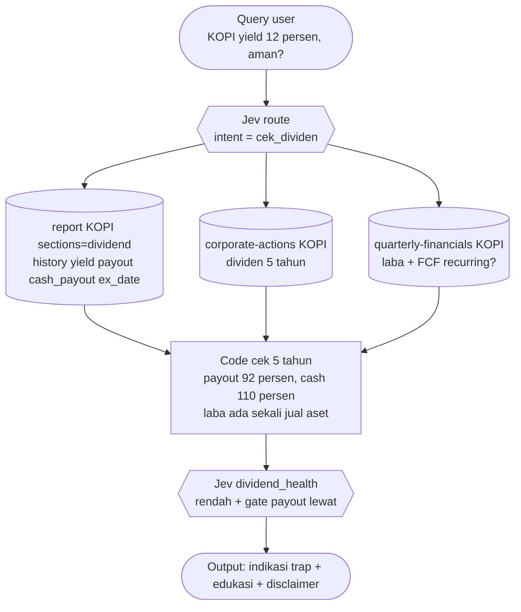

| Tahap | Contoh data yang berpindah |
|---|---|
| Fetch | yield `12,1%`, payout `92%`, cash payout `110%`, ex-date `12 Mei 2026`, laba 2024 ada pos non-recurring `1,8T` |
| Judge | `dividend_health=0,28`, `verdict=likely_trap (0,78)` |
| Guard | severity tinggi → blokir klaim `dividen aman`, tampilkan edukasi |

**Output final (ilustrasi):** `Tidak seaman kelihatannya: payout 92% + cash payout 110% artinya dividen dibayar melebihi kas operasi, dan laba 2024 terbantu jual aset sekali saja. Yield 12% ini rawan dipangkas... Bukan rekomendasi investasi.`

---

## PP-07 — Buta valuasi wajar

**Query user:** `BBCA PBV 2,1x sekarang. Itu mahal atau murah sih?`

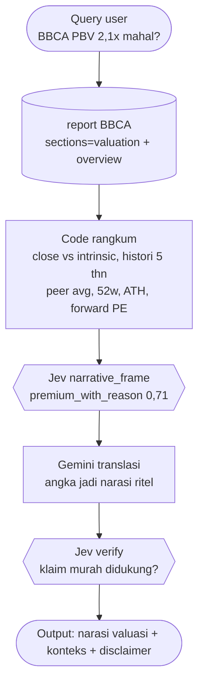

| Tahap | Contoh data yang berpindah |
|---|---|
| Fetch | close `10.450`, intrinsic `9.800`, PBV histori `1,8-2,4`, peer avg `1,6`, 52w `8.900-11.200`, forward PE `19x` |
| Judge | `cheap_vs_history=0,45`, `cheap_vs_peers=0,22`, frame `premium_with_reason` |
| Verify | narasi `didukung=0,90` |

**Output final (ilustrasi):** `PBV 2,1x itu di tengah histori BBCA (1,8-2,4) tapi premium vs rata-rata bank (1,6x). Pasar membayar lebih mahal karena ROE dan CASA-nya paling kuat. Jadi: tidak murah, tapi ada alasannya... Bukan rekomendasi investasi.`

---

## PP-08 — Verifier pompom

**Query user:** `Dapat ini dari grup Telegram: GASSS AKUM BANDAR GOTO生产 BESOK TERBANG 50 PERSEN, JANGAN SAMPAI KETINGGALAN!!! Gimana menurutmu?`

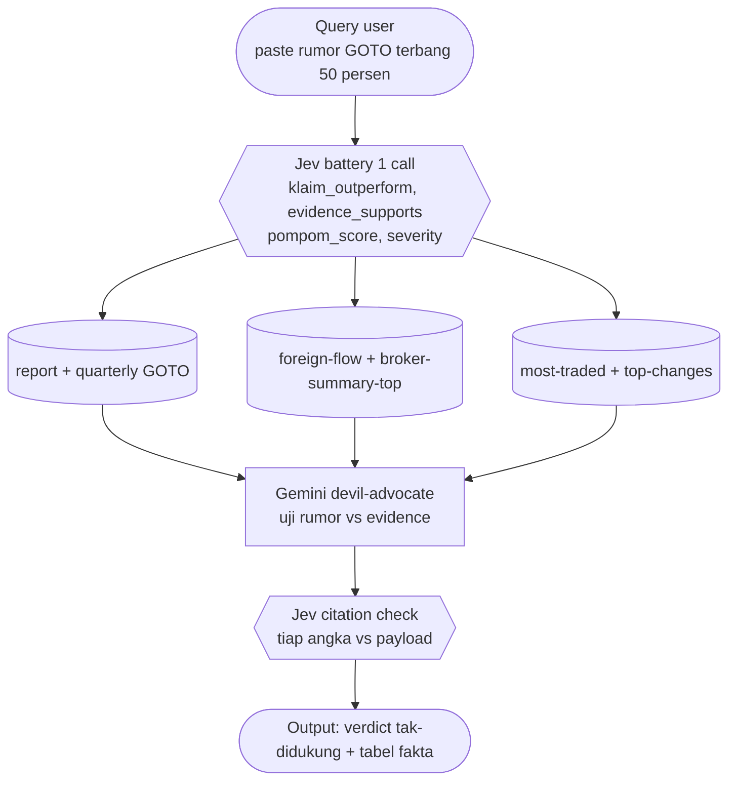

| Tahap | Contoh data yang berpindah |
|---|---|
| Battery | `klaim_outperform=0,97`, `pompom=2,8 dari 3`, `evidence_supports=0,12`, `severity=2,4` |
| Fetch | rugi bersih `3 kuartal beruntun`, foreign net `minus 420M 5 hari`, broker top sellers dominan |
| Verify | semua angka `verified`, verdict `tak-didukung (0,86)` |

**Output final (ilustrasi):** `Rumor tidak didukung data: GOTO rugi 3 kuartal beruntun, asing jual bersih 420M/5 hari, top broker sisi jual dominan. Bahasa TEBANG 50 PERSEN tanpa angka = ciri pompom. Kamu berisiko jadi exit liquidity... Bukan rekomendasi investasi.`

---

## PP-09 — Second opinion sebelum BUY

**Query user:** `Mau beli MMMM nih, yakin? Free float 12 persen, rugi 3 kuartal, volume anomali 10x lipat.`

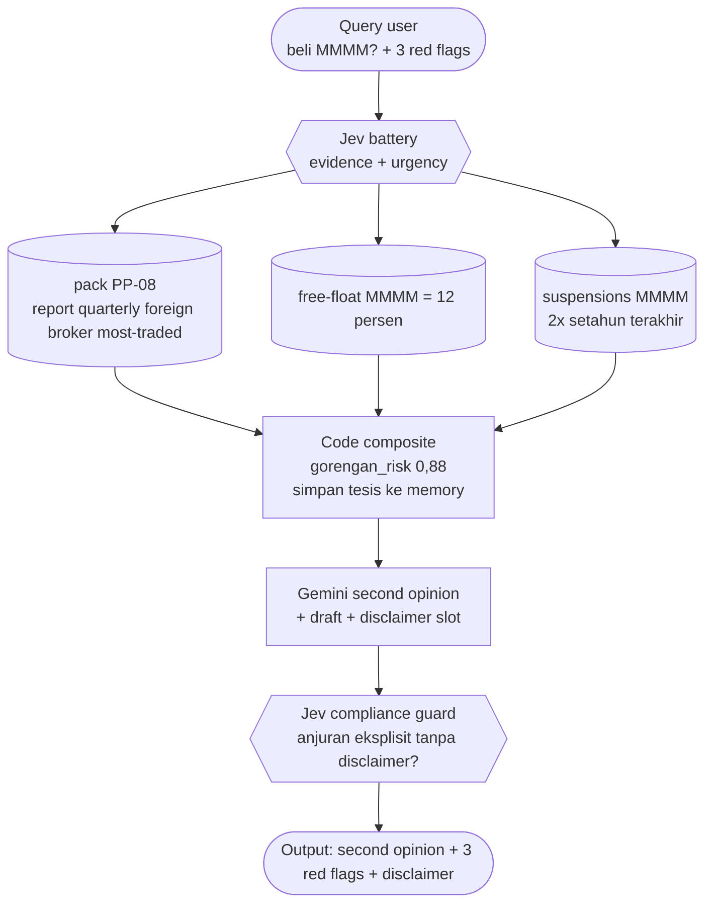

| Tahap | Contoh data yang berpindah |
|---|---|
| Fetch | free float `12%`, rugi `3 kuartal`, volume `10,2x rata-rata`, suspensi `2x/12 bln` |
| Memory | tesis awal `spekulasi jangka pendek, cut-loss 7%` tersimpan |
| Guard | draft lolos (disclaimer ada), `gorengan_risk=0,88` → tampil + konfirmasi |

**Output final (ilustrasi):** `Second opinion: 3 red flag valid semua — float 12% (di bawah 15%), rugi 3 kuartal, volume 10x tanpa berita. Riwayat suspensi 2x. Kalau tetap masuk, itu spekulasi murni sesuai tesismu (cut-loss 7%), bukan investasi... Bukan rekomendasi investasi.`

---

## PP-10 — Verifikasi bandar / foreign

**Query user:** `Katanya foreign masuk besar ke BBRI minggu ini. Beneran akumulasi?`

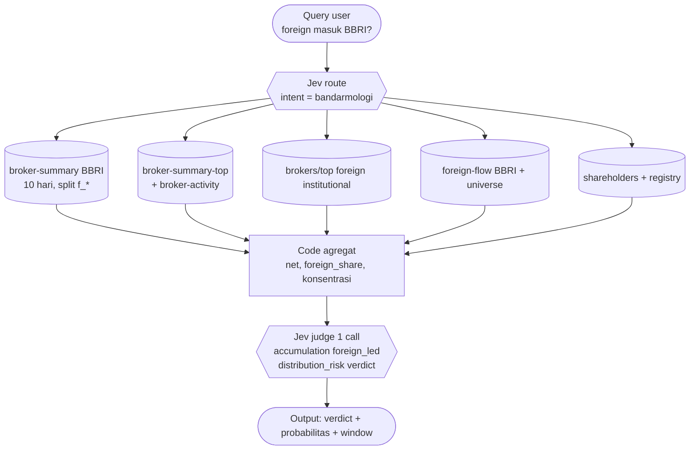

| Tahap | Contoh data yang berpindah |
|---|---|
| Fetch | net broker `+1,2T/10 hr`, `f_* = 78%`, top-3 buyer `62%`, foreign universe BBRI rank `2`, institusi asing tambah `0,4%` |
| Judge | `accumulation=0,81`, `foreign_led=0,77`, `distribution_risk=0,9 dari 3 rendah`, `verdict=akumulasi (0,78, conf 0,71)` |
| Catatan | label dinyatakan sebagai inferensi probabilistik, bukan fakta |

**Output final (ilustrasi):** `Terindikasi akumulasi 0,78 (conf 0,71): net beli 1,2T/10 hari, 78% porsi asing, top-3 buyer 62%, asing tambah 0,4%. Tapi ini inferensi pola broker, bukan fakta niat bandar. Window hanya 10 hari... Bukan rekomendasi investasi.`

---

## PP-11 — Risiko illiquid / gorengan

**Query user:** `Cek likuiditas saham ZZZZ dong, aku takut nyangkut kayak kemarin.`

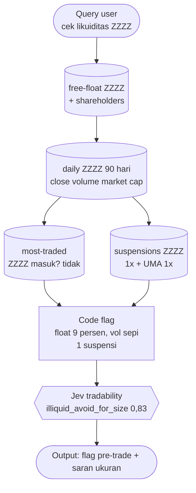

| Tahap | Contoh data yang berpindah |
|---|---|
| Fetch | free float `9%`, avg value `1,8M/hari`, tidak pernah top-50 traded, suspensi `1x`, UMA `1x` |
| Judge | `illiquidity_risk=2,6 dari 3`, `exit_risk_panic=0,87` |
| Aturan | tampil SEBELUM user masuk (pre-trade) |

**Output final (ilustrasi):** `Jangan masuk dengan size besar: float cuma 9%, transaksi harian 1,8M (sepi), ada suspensi + UMA setahun terakhir. Saat panik kamu bisa antre jual berhari-hari. Kalau nekat, batasi maksimal 1-2% portofolio... Bukan rekomendasi investasi.`

---

## PP-12 — Watcher kalender (ex-date, RUPS, rights, split)

**Query user:** `Dividen BMRI kapan ex-date-nya? Aku karyawan, takut kelewat cum-date kayak tahun lalu.`

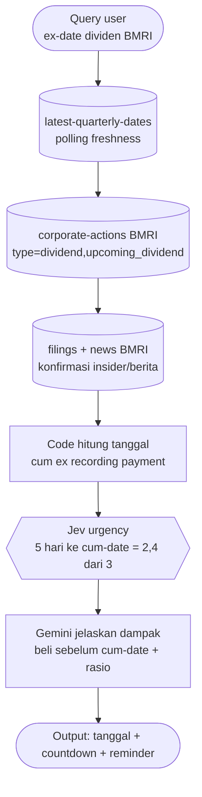

| Tahap | Contoh data yang berpindah |
|---|---|
| Fetch | dividen `Rp 450/lembar`, cum `20 Jun`, ex `23 Jun`, recording `24 Jun`, payment `11 Jul` |
| Compute | sisa `3 hari bursa` ke cum-date → urgency tinggi |
| Watcher | reminder H-1 otomatis tersimpan di memory |

**Output final (ilustrasi):** `BMRI Rp 450/lembar: terakhir beli (cum) 20 Jun, ex 23 Jun — tinggal 3 hari bursa! Beli di 23 Jun ke atas = tidak dapat dividen ini. Payment 11 Jul. Reminder H-1 sudah saya pasang... Bukan rekomendasi investasi.`

---

## PP-13 — Rotasi sektoral & foreign flow

**Query user:** `Sektor apa yang lagi dilirik asing minggu ini? Kasih briefing sebelum market buka.`

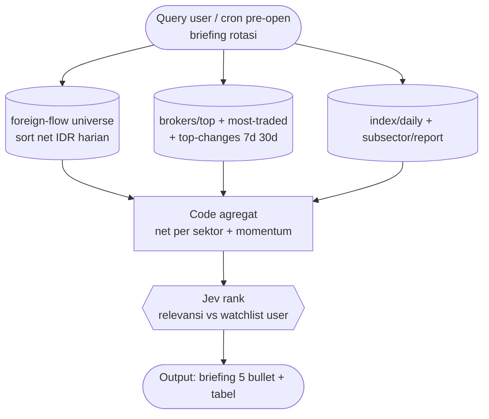

| Tahap | Contoh data yang berpindah |
|---|---|
| Fetch | net asing `bank +2,1T, energi -0,8T, tech +0,4T`; top gainers 7d didominasi bank; IHSG `+1,2%/minggu` |
| Judge | `rotation_strength bank=0,82`, `watchlist_impact=0,79` (user pegang 2 bank) |
| Output | headline bank, footnote tech |

**Output final (ilustrasi):** `Briefing pagi: 1) Asing net beli bank 2,1T seminggu — watchlist-mu (BBCA, BMRI) kena dampak positif... 4) Energi dilepas 0,8T, hindari kejar... 5) Tech mulai dilirik tapi kecil. Detail tabel... Bukan rekomendasi investasi.`

---

## PP-14 — IPO 3 menit

**Query user:** `IPO PT Fiktif Energi (FIKT) layak ikut? Prospektusnya 300 halaman, pusing.`

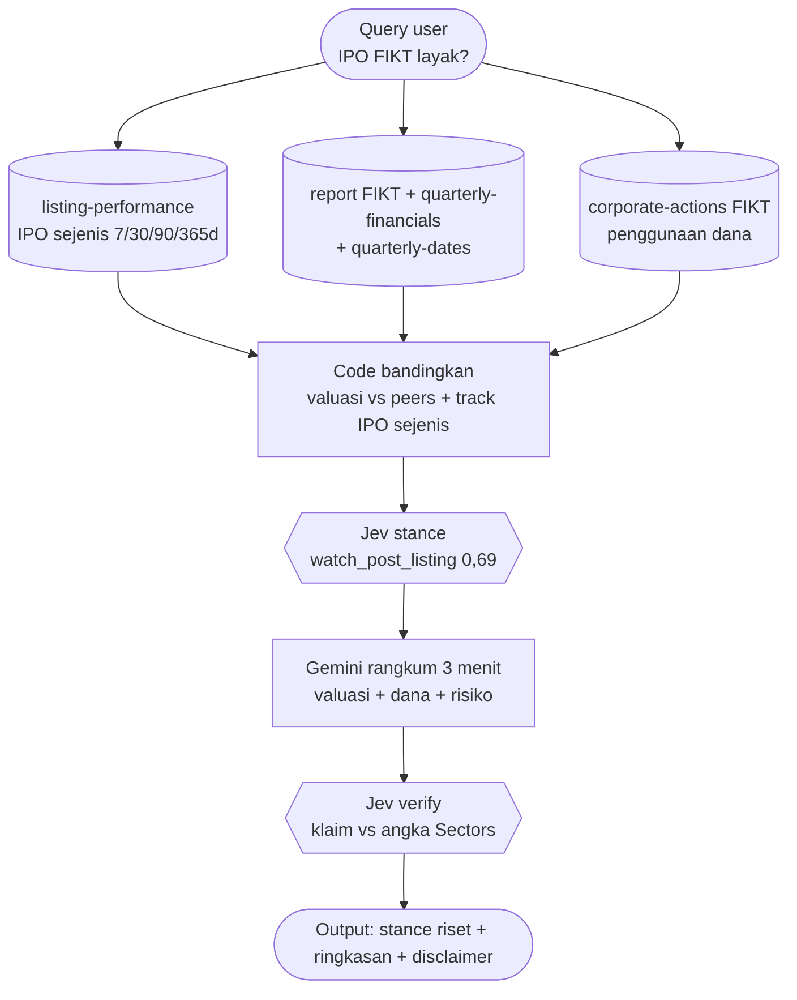

| Tahap | Contoh data yang berpindah |
|---|---|
| Fetch | PER offer `14x` vs peers `9-11x`, 60% dana bayar utang, IPO energi sejenis rata-rata `-18%/90 hr` |
| Judge | `valuation_vs_peers=0,31 mahal`, `use_of_proceeds=0,42`, `stance=watch_post_listing (0,69)` |
| Verify | 4 klaim `verified`, stance dinyatakan sebagai prioritas riset |

**Output final (ilustrasi):** `Ringkasan 3 menit FIKT: valuasi 14x lebih mahal dari peers (9-11x), 60% dana buat bayar utang bukan ekspansi, IPO energi sejenis rata-rata minus 18% dalam 90 hari. Stance: pantau pasca-listing dulu, bukan prioritas ikut... Bukan rekomendasi investasi.`
